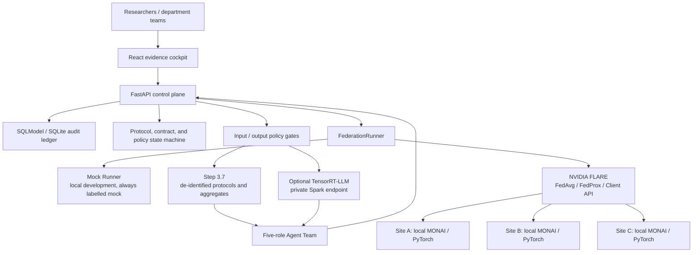

<div align="center">


# RareLink

### Turn scarce cases into collaborative, verifiable, durable research evidence

**A trusted multi-centre medical-research Agent platform · federated learning and evidence cockpit**

<a href="README.md">中文</a> · <strong>English</strong>

<strong>📘 <a href="outputs/RareLink-项目报告书.md">Project report (Chinese)</a></strong> · <a href="#deployment-and-quick-start">Quick start</a> · <a href="#engineering-evidence-and-claim-boundaries">Engineering evidence</a>

<a href="https://www.nvidia.com/en-us/products/workstations/dgx-spark/"></a>
<a href="https://nvidia.github.io/NVFlare/"></a>
<a href="https://project-monai.github.io/"></a>

<a href="LICENSE"></a>

</div>

> **Research-use engineering prototype.** RareLink does not provide diagnostic or treatment advice. Current hardware validation uses three **logical sites** on one real DGX Spark, plus a Spark–Mac mTLS exercise. Neither is a production multi-hospital deployment or clinical validation.

---

## Contents

- [Why RareLink](#why-rarelink)
- [Project report (Chinese)](outputs/RareLink-项目报告书.md)
- [From a research question to an evidence package](#from-a-research-question-to-an-evidence-package)
- [Product experience and capabilities](#product-experience-and-capabilities)
- [System architecture and data boundaries](#system-architecture-and-data-boundaries)
- [Multi-Agent collaboration and model strategy](#multi-agent-collaboration-and-model-strategy)
- [DGX Spark and NVIDIA foundation](#dgx-spark-and-nvidia-foundation)
- [Engineering evidence and claim boundaries](#engineering-evidence-and-claim-boundaries)
- [Deployment and quick start](#deployment-and-quick-start)
- [Roadmap, references, and responsible use](#roadmap-references-and-responsible-use)

---

## Why RareLink

Rare-disease, paediatric-tumour, and other small-cohort imaging research rarely fails because a model is missing. It fails because source data cannot be pooled, sites differ, study plans drift, experiments are hard to replay, an average metric can hide a weak site, and language models must not cross clinical-data boundaries.

RareLink joins protocol design, site feasibility, experiment contracts, local training, federated aggregation, privacy review, and research reporting into a controlled loop: **data stays with the department, models train locally, only approved updates and aggregate metrics cross sites, and every consequential step leaves verifiable evidence.**

| Research challenge | Product response |
| --- | --- |
| Source MRI, labels, and patient fields cannot be pooled | NIfTI and labels remain local; policy gates reject source images, identifiers, DICOM UIDs, secrets, paths, and small-cell fields from outbound flows |
| One average score can hide site risk | Mean Dice, weakest-site Dice, site spread, and HD95 are fixed in the contract and surfaced together |
| Processes are coordinated in documents and conversations | A state machine, locked contract, hashes, audit ledger, and one-click verification turn the process into a product |
| Agents can overreach or leave no trace | Five role-specific Agents see de-identified protocols and aggregates only; human approval, schemas, and bidirectional gates constrain them |
| “Federated” is often confused with “automatically compliant” | Security communication, DP accounting, minimum-cell policy, failed configurations, and claim boundaries belong in the evidence package |

### Built for the people doing the work

| User | What RareLink helps them do |
| --- | --- |
| **Department research teams** | Draft studies, assess site feasibility, inspect training/aggregation state, and export traceable research evidence |
| **Multi-centre coordinators** | Fix endpoints, budgets, and egress policy; compare sites; manage approvals and audit trails |
| **AI and platform teams** | Deploy MONAI, NVIDIA FLARE, control-plane services, and an optional local-LLM route on DGX Spark |
| **Partners and governance teams** | Inspect system boundaries, evidence provenance, privacy constraints, and pilot prerequisites rather than receiving a single performance number |

---

## From a research question to an evidence package

RareLink is not a standalone “train” button. It is a recoverable, auditable research workflow:

```text
research question
  → structured protocol
  → site feasibility (minimum necessary aggregates only)
  → experiment contract + human lock
  → local training / federated aggregation
  → metrics, model and run receipt in ledger
  → statistics and privacy review
  → research report and evidence package
```

1. **Define the protocol.** A researcher describes a question, cohort boundary, and objective; the Research Director structures it without seeing case-level images.
2. **Confirm feasibility.** Sites return only aggregates that meet the minimum-cell policy.
3. **Lock the contract.** Splits, strategies, rounds, primary endpoints, weakest-site metrics, and release limits are fixed by a human principal investigator.
4. **Compute locally.** DGX Spark runs MONAI/PyTorch 3D training; NVIDIA FLARE coordinates approved updates and aggregation.
5. **Interpret without overclaiming.** Statistical and Privacy Agents work from aggregate evidence and can flag risk or block unsafe release.
6. **Deliver an inspectable package.** Hashes, metrics, model paths, policy, and stated limitations travel together.

---

## Product experience and capabilities

The frontend explicitly separates an interactive research-workflow sandbox from persisted hardware evidence. The former helps teams understand protocol, contract, Agent, and approval states; the latter verifies training, aggregation, and security claims.

<table>
  <tr>
    <td align="center" width="50%"><b>Research workflow and boundaries</b></td>
    <td align="center" width="50%"><b>Evidence cockpit</b></td>
  </tr>
  <tr>
    <td></td>
    <td></td>
  </tr>
</table>

### Study protocol, contracts, and audit ledger

- Turn a research question into a structured protocol with approval, version, and state transitions.
- Lock strategy, rounds, endpoints, weakest-site metrics, and egress limits into an experiment contract.
- Persist training jobs, logs, aggregates, model paths, failures, and retries in a traceable ledger.
- Retry failed work without silently overwriting evidence or creating a duplicate experiment.

### Federated research designed for site differences

- Compare Local, FedAvg, FedProx, strict SVT, and sample-level DP-SGD.
- Evaluate mean Dice, weakest-site Dice, site variance, and HD95 together.
- Serialize 3D workloads in the one-Spark prototype with a unified-memory guard.
- In a real deployment, each department runs an independent Spark Client and the coordinator receives approved updates and aggregates only.

### Evidence cockpit and one-click verification

- Read persisted public-data run receipts with `3/3` aggregation, global-model, site-metric, and boundary information.
- Verify local evidence hashes and expand site-level Dice, HD95, and timing.
- Start a replay package without downloading medical images, weights, certificates, or API keys.
- Surface “endpoint online,” “receipt captured,” and “independently verified” separately; missing evidence is `NOT CLAIMED`, never fabricated.

### Research safety is a product feature

Input gates reject source images, identifiers, DICOM UIDs, paths, and secrets. Output gates block diagnostic instructions, patient-data requests, clinical overclaims, and unapproved contract escalation. Privacy review can block reporting, but cannot relax deterministic egress policy.

<p align="center">
  
</p>

---

## System architecture and data boundaries

RareLink relies on mature frameworks for commodity functions. Project-specific code concentrates on the research state machine, experiment contracts, data-egress policy, evidence linkage, and the Spark/FLARE adapter—keeping safety-critical logic readable, testable, and auditable.



| Boundary | System rule | Purpose |
| --- | --- | --- |
| **Data boundary** | NIfTI, labels, patient fields, and DICOM UIDs stay on site | Keep source case material out of control-plane and Agent flows |
| **Compute boundary** | Imaging training runs locally on DGX Spark; federation coordinates approved updates | Keep heavy computation near the data and reduce centralized exposure |
| **Language-model boundary** | Step 3.7/local LLMs consume de-identified protocol and aggregate context only | Let Agents assist the research process without reading imaging or credentials |

---

## Multi-Agent collaboration and model strategy

RareLink does not let a generic chatbot decide a study. It divides work into verifiable, blockable, and recoverable roles.

| Agent role | Permitted input | Output | Cannot do |
| --- | --- | --- | --- |
| Research Director | De-identified question and cohort description | Structured research protocol | Access images, labels, or case fields |
| Experiment Designer | Protocol and feasibility aggregates | Local/FedAvg/FedProx comparison contract | Lock the contract or change endpoints alone |
| Statistical Reviewer | Verified aggregate metrics | Weakest-site risk, metric interpretation, limits | Turn small, one-off results into medical conclusions |
| Privacy Reviewer | Report draft and policy state | Release/block recommendation | Relax data-egress policy |
| Research Writer | Approved evidence and limits | Traceable research narrative | Generate diagnostic advice or invent a run result |

| Route | Best for | Boundary and fallback |
| --- | --- | --- |
| `step_remote` | Step 3.7-assisted protocol, statistics, and writing | Sends policy-filtered text/aggregates only; can fall back when the API is unavailable |
| `spark_local` | TensorRT-LLM on a private Spark endpoint | Aggregates only; requires a real GPU and content-free receipt before being described as verified |
| `template` | Offline demos, tests, and no-key environments | Deterministic template Agent keeps the workflow stable and testable; never presented as model inference |

Step 3.7 integration is not merely a configuration flag: every successful live call that passes JSON-schema validation and the output safety gate produces a local metadata-only receipt. It contains no prompt, completion text, image, case field, or credential. The evidence cockpit shows `STEP 3.7 AGENT RUNTIME · VERIFIED` only when such a receipt exists; see the [deployment guide](docs/deployment.md) for the exact commands and boundary.

> The TensorRT-LLM adapter, deployment scripts, receipt tooling, red-team harness, and concurrency benchmark exist. Until a real Spark model call, red-team run, and benchmark are captured, RareLink does not claim measured local-LLM performance or medical capability.

---

## DGX Spark and NVIDIA foundation

RareLink treats DGX Spark as a trusted department-side compute unit, not merely a web host. It can host 3D training, a federated Client, control-plane services, evidence delivery, and an optional local-Agent boundary. For medical research, this full-stack deployment near the data is more appropriate than moving large images to a remote service.

| Technology | Role in RareLink | Current implementation or evidence |
| --- | --- | --- |
| [NVIDIA DGX Spark](https://www.nvidia.com/en-us/products/workstations/dgx-spark/) | GB10 / ARM64 local compute and runtime boundary | CUDA, MONAI 3D, FLARE, API/web ran on hardware; one MSD three-site round completed in about `69 s` |
| [CUDA](https://developer.nvidia.com/cuda) + [PyTorch](https://pytorch.org/) | Tensor compute, AMP, and training runtime | MONAI training and federated client work on Spark |
| [NVIDIA FLARE](https://nvidia.github.io/NVFlare/) | FedAvg/FedProx, Client API, mTLS, orchestration | Three logical-site aggregation; Spark–Mac mTLS registration, reconnect, and invalid-identity rejection exercise |
| [MONAI](https://project-monai.github.io/) | NIfTI, 3D SegResNet, transforms, Dice/HD95 | Synthetic controls and public MSD Task01 engineering verification |
| [TensorRT-LLM](https://github.com/NVIDIA/TensorRT-LLM) (optional) | Private OpenAI-compatible Agent endpoint on Spark | Code, deployment/verifier, 26 local-gateway red-team cases, and `1/2/4` concurrency tools are delivered; no receipt means `NOT CLAIMED` |
| [Step 3.7](https://platform.stepfun.com/) | Policy-constrained protocol, experiment design, statistics/privacy review, and writing | Receives de-identified text and aggregates only; deterministic template fallback without a key |

This division addresses three deployment facts at once: 3D imaging needs local compute, institutions cannot casually move source data, and research conclusions must remain traceable. NVIDIA FLARE alone does not guarantee compliance; RareLink adds policy, identity, audit, and DP-SGD controls around it.

---

## Engineering evidence and claim boundaries

### Public real-imaging engineering verification

RareLink completed an engineering-compatibility verification on public MSD `Task01_BrainTumour` data using an NVIDIA DGX Spark GB10 (ARM64, CUDA 13, PyTorch `2.10.0+cu130`, MONAI `1.6.0`, NVIDIA FLARE `2.7.2`). The archive was downloaded directly by Spark and checked against its published MD5 and a local SHA-256. The repository stores no images, labels, case IDs, case-level paths, or weights.

After geometry checks, 24 four-modality 3D MRIs were deterministically divided by tumour-voxel quantiles into three logical sites of eight cases. The MSD `0/1/2/3` labels were mapped to the project’s `0/1/2` contract; depth 155 was padded to 156 using `DivisiblePadd(k=4)`.

| Run | Training configuration | Verifiable result |
| --- | --- | --- |
| Single-site CUDA smoke test | `site-a`: 7 train / 1 validation case, 1 epoch | Loss `1.818046`; mean foreground Dice `0.008702`; HD95 `117.379684`; `6.7476 s`; peak GPU memory `5240.349 MiB` |
| Three-logical-site FedAvg | 8 cases/site, 1 local epoch, 1 federation round | `3/3` client updates aggregated with global model persisted; `69.0084 s` end-to-end; peak GPU memory `5240.349 MiB` |

| Site | Dice | HD95 | Training loss | Local duration |
| --- | ---: | ---: | ---: | ---: |
| `site-a` | `0.012345` | `119.771957` | `1.657893` | `6.6302 s` |
| `site-b` | `0.040765` | `107.582993` | `1.653218` | `6.3943 s` |
| `site-c` | `0.071763` | `79.886047` | `1.649940` | `6.7046 s` |
| Aggregate observation | **`0.041624`** | **`102.413666`** | — | **`69.0084 s`** |

### Stability, privacy, and safety checks

| Check | Method | Current result | Boundary that remains |
| --- | --- | --- | --- |
| Stability | 5 random seeds × Local / FedAvg / FedProx / strict SVT / DP-SGD, 3 rounds | `25/25` combinations completed | Synthetic data/logical sites only; not medical statistical inference |
| Sample-level DP-SGD | Opacus clipping, Gaussian noise, Poisson sampling, RDP accounting | Conservative three-round `ε=6.076881`, `δ=1e-5` | Local training steps only; not end-to-end, user-level, or hospital-level DP |
| Secure federation | Spark–Mac mTLS registration, reconnect, invalid-identity rejection | Positive and negative controls recorded | Not a hospital production network, identity system, or complete penetration test |
| Agent safety | 12 input + 14 output deterministic gateway cases | `26/26` passed | Tests policy gateways; not general model-safety certification |

These results **do demonstrate** real four-modality NIfTI intake, CUDA training, FLARE aggregation, global-model persistence, and controlled Agent workflows. They **do not demonstrate** clinical efficacy, strategy superiority, hospital-WAN operation, or paediatric rare-disease performance. Explicit boundaries are a core part of a trustworthy research platform.

---

## Deployment and quick start

### Three deployment layers

| Layer | Purpose | Deployment |
| --- | --- | --- |
| **Local development / demo** | Explore the workflow and evidence cockpit | React + FastAPI + SQLite; deterministic template Agents and labelled evidence snapshots are available |
| **Single-Spark engineering validation** | Validate CUDA, MONAI, FLARE, policy, and evidence chain | One DGX Spark runs three logical sites and serializes work to protect unified memory |
| **Real multi-hospital research pilot** | Independent local computing without exporting source data | One Spark Client per hospital + certificate-based FLARE + local audit; requires IRB, data-use, and security review |

### One-command experience

No medical images, weights, certificates, or API keys are needed:

```bash
git clone https://github.com/dingyucanada/RareLink.git
cd RareLink
bash scripts/review_demo.sh
```

The terminal prints a local URL. The package checks `25/25` repeated experiments, DP-SGD accounting, Spark–Mac mTLS negative controls, and `26/26` Agent gateway cases. When local artifacts are missing, it writes only clearly labelled de-identified demonstration snapshots; it never presents them as new experiments.

### Local development

```bash
cp .env.example .env
python3 -m venv .venv
. .venv/bin/activate
make install
make install-web
make dev-api
```

In a second terminal:

```bash
make dev-web
```

Open `http://localhost:5173`; API docs are at `http://localhost:8000/docs`. Without `STEP_API_KEY`, deterministic template Agents still run the controlled workflow. Keep all secrets in local `.env` files.

### Optional public-imaging engineering run on Spark

Download public MSD Task01 **directly on the Spark node**; do not transfer large files through SSH/SCP:

```bash
python scripts/prepare_msd_brain_tumour.py \
  --data-root data/raw/msd-task01 \
  --output data/runtime/msd-brain-tumour-v1 \
  --cases-per-site 8

python scripts/run_nvflare_simulation.py \
  --manifest data/runtime/msd-brain-tumour-v1/manifest.json \
  --strategy fedavg --rounds 1 --local-epochs 1 \
  --workspace artifacts/msd-fedavg
```

Before running, confirm `aarch64`, `nvidia-smi`, Python 3.11+, free disk, and a safe unified-memory margin. Use the NVIDIA PyTorch container or the repository Spark bootstrap script where appropriate.

---

## Roadmap, references, and responsible use

### Next milestones

| Stage | Goal | Prerequisites |
| --- | --- | --- |
| External engineering validation | Repeat the workflow with authorised paediatric public data such as BraTS-PEDs | Data-use policy, preprocessing, citation, and transparent reporting limits |
| Real multi-hospital pilot | Independent Spark Clients, certificate-based FLARE, local audit | IRB, data-use agreement, security review, network and identity readiness |
| Clinical research collaboration | PACS/FHIR integration, governance, cross-site feasibility, evidence packages | Institutional partners, independent clinical validation, regulatory pathway |
| Local-Agent upgrade | Capture real TensorRT-LLM receipts, concurrency data, and security red-team evidence | Available local model and compliant inference resources |

### Further reading and primary sources

- [DGX Spark product page](https://www.nvidia.com/en-us/products/workstations/dgx-spark/) · [DGX Spark User Guide](https://docs.nvidia.com/dgx/dgx-spark/index.html)
- [NVIDIA FLARE documentation](https://nvidia.github.io/NVFlare/) · [healthcare catalog](https://nvidia.github.io/NVFlare/catalog/)
- [Project MONAI](https://project-monai.github.io/) · [Opacus](https://opacus.ai/)
- [NIST federated-learning glossary](https://csrc.nist.gov/glossary/term/federated_learning) · [NIST privacy-attack overview](https://www.nist.gov/blogs/cybersecurity-insights/privacy-attacks-federated-learning)
- [Medical Segmentation Decathlon](https://medicaldecathlon.com/dataaws/) · [BraTS-PEDs / TCIA](https://www.cancerimagingarchive.net/collection/brats-peds/)
- Project records: [deployment guide](docs/deployment.md) · [architecture](docs/architecture.md) · [MSD hardware run report](outputs/RareLink-2026-07-20-MSD真实影像Spark联邦运行报告.md) · [DGX Spark system report](outputs/RareLink-2026-07-17-DGX-Spark系统移植与实机实验正式报告.md)

### DGX Spark Hackathon note

RareLink was built and open-sourced during the DGX Spark Hackathon. Its purpose is to show, through runnable software, public engineering evidence, and explicit limits, how DGX Spark, NVIDIA FLARE, MONAI, and Step 3.7 can work together for multi-centre research where data remains on site. It is not a substitute for clinical validation or a real hospital-deployment claim.

### Safety and responsible use

Never commit API keys, passwords, patient images, DICOM identifiers, source manifests, or identifiable clinical fields. Follow the licence, citation, and access policy of every public dataset. Any clinical or real multi-hospital deployment requires institutional approval, data-use agreements, security review, and independent validation.

## License

[Apache-2.0](LICENSE)
