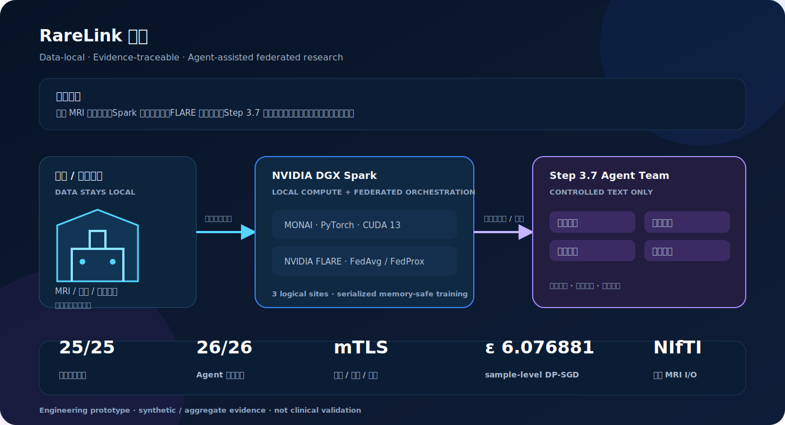

# RareLink

<p align="center">
  <a href="README.md">中文</a> · <strong>English</strong>
</p>

<p align="center">
  
</p>

<p align="center">
  <a href="https://github.com/dingyucanada/RareLink/releases"></a>
  <a href="https://github.com/dingyucanada/RareLink/blob/main/LICENSE"></a>
  
  
  
</p>

RareLink is a data-local, evidence-traceable federated research platform for rare-disease and multi-center medical-imaging studies. Each participating department can keep patient-level MRI data locally while DGX Spark runs the local imaging workload, NVIDIA FLARE coordinates federated training, and a Step 3.7 Agent Team works only with policy-filtered protocols and aggregate evidence.

> Research-use engineering prototype. It is not a diagnostic or treatment system. The competition validation uses three logical sites on one physical DGX Spark; a separate Spark–Mac mTLS rehearsal does not represent production multi-hospital deployment.

## What the system does

RareLink treats federated learning as a research workflow, not only as a model-training primitive. A study moves through a controlled state machine: research question → protocol → site feasibility → locked experiment contract → local training → federated aggregation → statistical review → evidence report. Decisions, retries, model paths, metrics and policy checks are recorded in an audit ledger.

| Research problem | RareLink response |
| --- | --- |
| Patient MRI cannot simply be pooled | Local NIfTI/label processing; only approved model updates and aggregate statistics leave a site. |
| Average metrics can hide site failure | Reports include mean Dice, worst-site Dice, site variation and HD95. |
| Agents can overreach | Input redaction, output gates, human approval and a locked experiment contract. |
| Experiments are difficult to reproduce | Five seeds × five strategies × three rounds, mTLS receipts, DP accounting and a review script. |

## Architecture

The local compute boundary and the language-model boundary are intentionally separate:

1. **Hospital / department site** — MRI, labels and patient-level fields remain local.
2. **DGX Spark** — CUDA, PyTorch, MONAI and the local FLARE Client run the imaging workload.
3. **NVIDIA FLARE** — coordinates FedAvg/FedProx jobs, client identity and secure communication.
4. **Step 3.7 Agent Team** — receives only policy-approved text such as research protocols and aggregate metrics.
5. **Evidence cockpit** — exposes provenance, boundaries, metrics, failures and reproducibility receipts.

## Verified engineering evidence

| Area | Verified result | Claim boundary |
| --- | --- | --- |
| Local hardware | NVIDIA DGX Spark GB10, ARM64, CUDA 13; CUDA kernels, MONAI 3D training, FLARE aggregation and services ran on the node. | Not a clinical performance claim. |
| Stability | 25/25 combinations completed across five seeds, five strategies and three rounds. | Synthetic/logical-site engineering evidence, not medical statistics. |
| Privacy | Opacus sample-level DP-SGD; conservative three-round accounting `ε=6.076881`, `δ=1e-5`. | Not end-to-end, user-level, institution-level or clinical privacy assurance. |
| Secure federation | Spark–Mac mTLS registration, reconnect and wrong-identity rejection. | Not production hospital-WAN certification. |
| Agent safety | 26/26 deterministic red-team and safe-control cases passed. | Not a complete penetration test or medical-safety certification. |
| Public MRI intake | One public MNI152 image/structural-label pair passed local NIfTI geometry and hash checks. | Not MSD Task01, tumor performance or clinical validation. |

## Technology and data provenance

The authoritative references for NVIDIA DGX Spark, CUDA, NVIDIA FLARE, MONAI, Opacus, federated-learning terminology, rare-disease terminology, MSD and BraTS-PEDs are maintained in [Technical & Data References](docs/references.md).

Current data status is intentionally explicit:

- Synthetic four-modal MRI is generated locally for engineering tests.
- The public MNI152 pair is used only for external NIfTI intake and geometry validation.
- The repository contains a resumable MSD Task01 downloader and manifest validator, but the slow competition-node download is not presented as a completed benchmark result.
- BraTS-PEDs is a planned, policy-controlled external validation source, not a dataset already used for the current reported experiments.

## Documentation

- [Chinese project page](README.md)
- [Architecture](docs/architecture.md)
- [Deployment guide](docs/deployment.md)
- [Review and reproducibility package](DEMO.md)
- [Technical and data references](docs/references.md)
- [Technical stack](outputs/RareLink-技术栈说明.md)
- [Formal DGX Spark report](outputs/RareLink-2026-07-17-DGX-Spark系统移植与实机实验正式报告.md)
- [Enterprise roadmap](outputs/RareLink-企业化一页路线图.md)

## Quick start

The review package does not download medical images, model weights, certificates or API keys:

```bash
bash scripts/review_demo.sh
```

For the full local stack, see [DEMO.md](DEMO.md) and [the deployment guide](docs/deployment.md). If `STEP_API_KEY` is absent, RareLink uses a deterministic local template agent so the workflow remains runnable without external inference.

## Safety and responsible use

RareLink does not provide diagnosis or treatment advice. Do not commit API keys, passwords, patient images, DICOM identifiers, raw manifests or identifiable clinical fields. Public data must be used under the source dataset's license, attribution and access policy. Any future clinical or multi-hospital deployment requires institutional approvals, security review, data-use agreements and independent validation.

## License

Apache-2.0. See [LICENSE](LICENSE).

