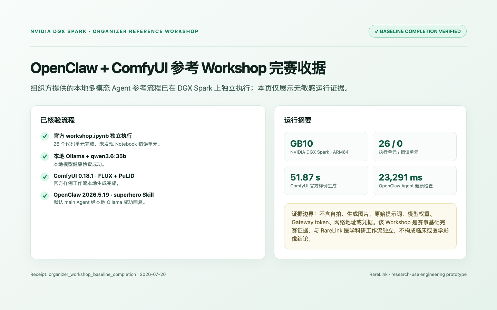

# RareLink 稀联

<p align="center">
  <strong>中文</strong> · <a href="README.en.md">English</a>
</p>

<p align="center">
  <strong>把稀缺病例，变成可协作、可复核的研究证据。</strong><br/>
  DGX Spark × NVIDIA FLARE × MONAI × Step 3.7
</p>

<p align="center">
  
  
  
  <a href="LICENSE"></a>
</p>

> 研究用途工程原型，不提供诊断或治疗建议。比赛版医学科研验证在一台真实 DGX Spark 上完成三个**逻辑站点**；另有 Spark–Mac mTLS 演练，但不等同于真实多医院生产部署或临床验证。

---

## 项目概述

罕见病与小样本医学影像研究的难点，不只是训练一个模型，而是让多家医院在原始数据不能集中时，仍能形成可复核、可解释、能继续迭代的科研证据。RareLink 将研究协议、站点可行性、实验合同、联邦训练、隐私审阅和科研报告组织为一个受控工作流：**数据留在科室，模型本地训练，跨站点只交换获准更新与聚合指标，研究过程写入审计账本。**

| 研究痛点 | RareLink 的实现 |
| --- | --- |
| 原始 MRI、标签与患者字段不能汇集 | 站点本地 NIfTI / 标签处理；输入网关拒绝原始影像、标识符、DICOM UID、密钥与小样本字段外发 |
| 平均指标掩盖弱站点风险 | 同时呈现平均 Dice、最弱站点 Dice、站点差异与 HD95 |
| Agent 容易越权或产生不可追溯结论 | 五角色 Agent 仅接触脱敏协议与聚合统计；实验合同、输入/输出门控和人工审批共同约束 |
| 实验难以复跑和解释 | 固定种子、策略矩阵、模型/结果哈希、mTLS 收据、DP 会计和一键证据核验 |

### 已核验的工程事实

| 证据 | 当前结果 | 结论边界 |
| --- | --- | --- |
| 真实公开影像 | MSD Task01 的 24 例四模态 MRI：几何/哈希校验、单站 CUDA 训练、三逻辑站点一轮 FedAvg；3/3 更新聚合并持久化全局模型 | 工程冒烟；非儿童队列、非临床性能、非真实跨院验证 |
| 稳定性对照 | 5 种子 × 5 策略 × 3 轮，25/25 组合完成 | 合成数据与逻辑站点工程比较，不能作医学统计推断 |
| 隐私与安全 | Opacus 样本级 DP-SGD：三轮保守会计 `ε=6.076881`、`δ=1e-5`；26/26 Agent 网关用例通过 | 非端到端、用户级或医院级 DP 保证；非完整渗透测试 |
| 安全联邦演练 | Spark–Mac mTLS 注册、重连、错误身份拒绝 | 非真实医院 WAN 或生产身份体系认证 |

完整结果、过程与限制见：[MSD 真实影像 Spark 联邦运行报告](outputs/RareLink-2026-07-20-MSD真实影像Spark联邦运行报告.md) 与 [DGX Spark 系统移植与实机实验正式报告](outputs/RareLink-2026-07-17-DGX-Spark系统移植与实机实验正式报告.md)。

---

## NVIDIA 工具平台

RareLink 不是把 DGX Spark 当作网页服务器；它承担本地 CUDA、MONAI 三维训练、NVIDIA FLARE 联邦任务、证据 API/Web 服务，以及可选的本地大模型推理边界。

| 平台 / 工具 | 在作品中的作用 | 已有证据 / 使用方式 |
| --- | --- | --- |
| [NVIDIA DGX Spark](https://www.nvidia.com/en-us/products/workstations/dgx-spark/) | 本地算力与运行边界 | GB10 / ARM64 / CUDA 13 实机运行 CUDA、MONAI 3D、FLARE、API/Web；MSD 一轮三站点聚合端到端约 69 秒 |
| [CUDA](https://developer.nvidia.com/cuda) + PyTorch | 本地张量计算、AMP 与训练运行时 | 在 Spark 上执行 MONAI 训练与联邦客户端任务 |
| [NVIDIA FLARE](https://nvidia.github.io/NVFlare/) | FedAvg/FedProx、Client API、mTLS 与联邦编排 | 真实三逻辑站点聚合；另有两物理设备 mTLS 证据 |
| [Project MONAI](https://project-monai.github.io/) | NIfTI、三维 SegResNet、影像变换与 Dice/HD95 评估 | 用于合成影像工程对照与 MSD Task01 公开数据工程验证 |
| [TensorRT-LLM](https://github.com/NVIDIA/TensorRT-LLM)（可选） | Spark 本地、OpenAI 兼容的研究 Agent 路由 | 元数据回执、独立核验、26 条网关红队与 `1/2/4` 并发工具已实现；没有真实本地模型回执时 UI 明确显示 `NOT CLAIMED` |
| Step 3.7 | 受策略约束的实验设计、统计评审、隐私评审、科研写作 | 仅接收脱敏文本和聚合指标；缺少密钥时自动回退为确定性模板 Agent |

### 赛事参考代码基础完赛（独立证据）

除 RareLink 医学科研链路外，已在同一 DGX Spark 执行组织方的 **OpenClaw + ComfyUI Workshop**：官方 `workshop.ipynb` 独立执行版本 26 个代码单元无错误；本地 Ollama `qwen3.6:35b` 健康回复成功；ComfyUI 0.18.1 以 FLUX + PuLID 生成官方超级英雄样例（51.87 秒）；OpenClaw 2026.5.19 Gateway 与 `superhero` Skill 均完成本地调用核验。它是赛事**参考代码基础完赛**，与 RareLink 医学证据独立，绝不作为临床或医学影像结论。[查看基础完赛收据与边界](docs/progress.md#2026-07-20--组织方-openclaw--comfyui-参考-workshop-基础完赛)。

<p align="center">
  
</p>

<p align="center"><sub>公开截图只展示无敏感完成状态与耗时；原始图像、提示词、权重、凭据和网络地址均未公开。</sub></p>

---

## 作品介绍（含系统界面）

RareLink 的前端不是“模拟医院游戏”。它将可点击的研究流程沙盘与已落盘的实机收据明确分开：沙盘用来演示协议、合同、Agent 和审批流程；实机收据用于重新计算哈希、核验 3/3 站点、全局模型、指标和边界。评委可在控制台点击“核验本地证据哈希”，再展开三个站点的 Dice、HD95 与训练耗时。

<p align="center">
  
</p>

<p align="center"><sub>系统界面与运行边界概览：原始影像不进入 Agent；对外输出受实验合同和策略门控。</sub></p>

### 真实产品运行截图

下图来自本地启动的 RareLink 前端，不是设计稿：顶部的 `DGX SPARK · VERIFIED RUN RECEIPT` 区域读取并展示已落盘的公开 MSD 工程收据；可点击核验哈希并展开站点明细。画面中的影像预览为项目内置的合成脱敏演示切片，不含真实患者影像。

<p align="center">
  
</p>

### 评审可操作路径

1. 启动“评审一键复现包”，进入证据驾驶舱；它不会下载影像、模型权重、证书或 API 密钥。
2. 点击“核验本地证据哈希”，确认三站点收据、全局模型和聚合结果未被篡改。
3. 展开站点明细，查看公开 MSD 工程运行的聚合指标与明确的非临床边界。
4. 在工作流沙盘中创建示范研究，依次体验协议、站点统计、合同锁定、训练策略和 Agent 证据解读。
5. 使用 `review_demo.sh` 导出或复核相同的证据门。

<p align="center">
  
</p>

**视频不应只讲 PPT。** 三分钟演示应先录制真实网页交互：点击核验、显示通过、展开站点收据；再演示 Agent 工作流和一键复现。可直接使用 [三分钟演示脚本](outputs/RareLink-三分钟演示视频脚本.md)。

---

## 技术创新点

1. **从“联邦训练”升级为“证据闭环”。** 研究协议、可行性、实验合同、任务状态、聚合指标、模型路径与审计事件被组织为可追溯状态机，而非只输出一次模型分数。
2. **计算边界与语言模型边界分离。** MRI 与标签留在站点；DGX Spark 运行影像训练；FLARE 只协调受批准更新；Step 3.7 或本地 TensorRT-LLM 仅消费经脱敏和小组抑制后的文本/聚合指标。
3. **隐私—效用不只停留在口号。** 以 Local、FedAvg、FedProx、严格 SVT、样本级 DP-SGD 进行对照，保留平均与最弱站点指标，避免仅展示最好看的结果。
4. **把 Agent 放进可审计的安全边界。** 双向网关阻断原始字段、标识符、路径、凭据和诊疗指令；26 条确定性攻击/安全对照用例在 Agent 前后执行。
5. **诚实的本地大模型证据机制。** 本地模型“可配置”不等于“已验证”：系统将端点可用、回执采集、独立验证分层呈现；无真实回执即为 `NOT CLAIMED`。

架构职责、数据流与 Agent 合同见 [系统架构](docs/architecture.md)，权威工具/数据来源见 [参考资料](docs/references.md)。

---

## 未来展望

RareLink 的目标不是替代医生，而是成为“**数据不出院、证据可回溯**”的多中心科研操作系统。下一阶段按风险与价值推进：

| 阶段 | 目标 | 前置条件 |
| --- | --- | --- |
| 外部工程验证 | 在合规授权的 BraTS-PEDs 等儿童公开数据上重复工程流程 | 数据使用政策、预处理与公开报告边界 |
| 真实多院试点 | 每院部署独立 Spark Client、证书化 FLARE 通信与本地审计 | IRB / 数据使用协议 / 安全评审 / 医院网络与身份体系 |
| 临床研究协作 | PACS/FHIR 对接、临床研究治理、站点间可行性与证据包 | 医疗机构合作、独立临床验证与法规路径 |
| 本地 Agent 升级 | 在 Spark 捕获真实 TensorRT-LLM 回执、并发数据和安全红队证据 | 获得可用本地模型与合规的推理资源 |

更多企业化路径见 [企业化一页路线图](outputs/RareLink-企业化一页路线图.md)。

---

## 快速开始

### 评委一键复现（推荐）

无需医学影像、模型权重、证书或 API Key；脚本仅在缺少运行产物时写入带边界标签的演示证据快照，绝不伪装成新实验：

```bash
git clone https://github.com/dingyucanada/RareLink.git
cd RareLink
bash scripts/review_demo.sh
```

随后打开终端给出的本地地址，或查看 [DEMO.md](DEMO.md) 中四个证据门的预期结果。

### 本地开发

```bash
cp .env.example .env
python3 -m venv .venv
. .venv/bin/activate
make install
make install-web
make dev-api
```

另开一个终端：

```bash
make dev-web
```

访问 `http://localhost:5173`；API 文档为 `http://localhost:8000/docs`。未配置 `STEP_API_KEY` 时，系统使用确定性模板 Agent，依然可以跑通受控工作流。密钥只放在 `.env`，不得提交。

### 可选：真实公开影像工程运行

请在 Spark 节点直接下载公开 MSD Task01，不要通过 SSH/SCP 上传大文件。脚本会校验公开归档 MD5、记录哈希，并按肿瘤体积分位数生成三站点非 IID 分割：

```bash
python scripts/prepare_msd_brain_tumour.py \
  --data-root data/raw/msd-task01 \
  --output data/runtime/msd-brain-tumour-v1 \
  --cases-per-site 8

python scripts/run_nvflare_simulation.py \
  --manifest data/runtime/msd-brain-tumour-v1/manifest.json \
  --strategy fedavg --rounds 1 --local-epochs 1 \
  --workspace artifacts/msd-fedavg
```

部署细节、ARM64/CUDA 检查、数据处理限制及完整命令见 [DGX Spark 部署手册](docs/deployment.md)。

### 项目资料入口

- [比赛项目说明（600 字以上）](outputs/RareLink-比赛项目说明.md)
- [技术栈说明](outputs/RareLink-技术栈说明.md)
- [最终提交清单](outputs/RareLink-最终提交清单.md)
- [DGX Spark 黑客松十日谈](outputs/RareLink-DGX-Spark黑客松十日谈.md)
- [正式实机实验报告](outputs/RareLink-2026-07-17-DGX-Spark系统移植与实机实验正式报告.md)
- [MSD 真实影像 Spark 报告](outputs/RareLink-2026-07-20-MSD真实影像Spark联邦运行报告.md)

## 安全与责任使用

请勿提交 API 密钥、密码、患者影像、DICOM 标识符、原始清单或可识别临床字段。公开数据须遵守来源许可、引用和访问政策；任何临床或真实多医院部署均需机构审批、数据使用协议、安全审查与独立验证。

## License

[Apache-2.0](LICENSE)
