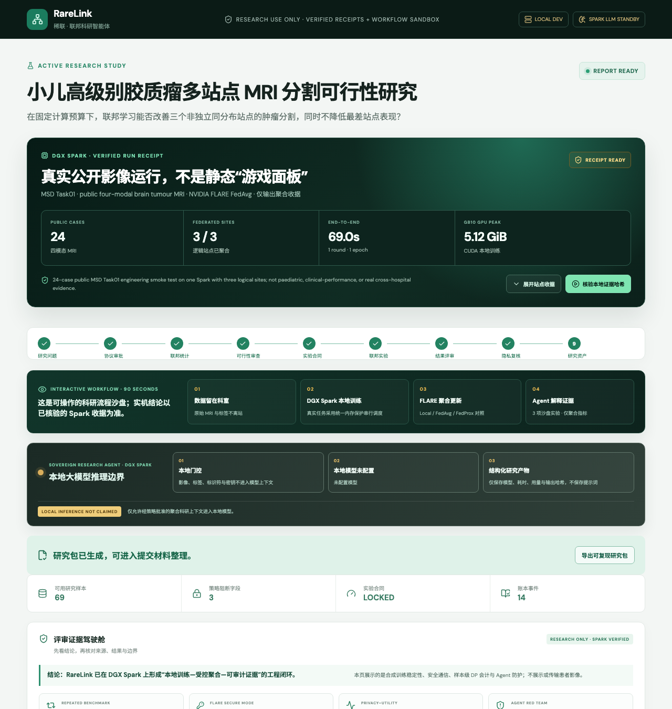
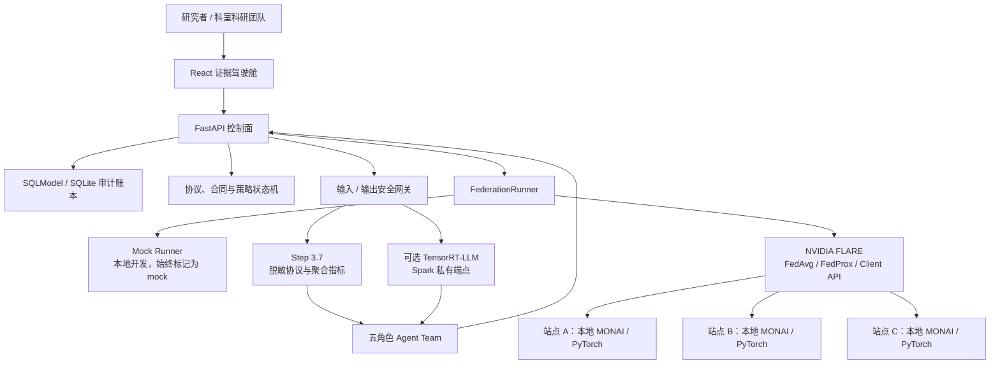

<div align="center">



# RareLink 稀联

### 让稀缺病例成为可协作、可复核、可延续的研究证据

**可信多中心医学科研 Agent 平台 · 联邦学习与证据驾驶舱**

<a href="README.en.md">English</a> · <strong>中文</strong>

<strong>📘 <a href="outputs/RareLink-项目报告书.md">阅读完整项目报告书</a></strong> · <a href="#部署模型与快速开始">快速开始</a> · <a href="#工程验证与可信边界">工程证据</a>

<a href="https://www.nvidia.com/en-us/products/workstations/dgx-spark/"></a>
<a href="https://nvidia.github.io/NVFlare/"></a>
<a href="https://project-monai.github.io/"></a>

<a href="LICENSE"></a>

</div>

> **研究用途工程原型。** RareLink 不提供诊断或治疗建议。当前实机验证在一台真实 DGX Spark 上以三个**逻辑站点**完成；另有 Spark–Mac mTLS 演练。两者均不等同真实多医院生产部署或临床验证。

---

## 产品演示视频

下方为 RareLink 最终演示成片：以真实产品界面的证据哈希核验、站点收据、研究工作流、Agent 安全护栏和一键复现为主，PPT 仅用于解释架构与路线图。视频中的公开 MSD 工程验证为单 Spark 三逻辑站点原型，不构成临床结论或真实跨医院部署证明。

<p align="center">
  <a href="assets/demo/RareLink_稀联_Demo_最终提交版.mp4">
    
  </a>
</p>

> **时长：** 4 分 00 秒｜**规格：** 1920×1080、30fps、真人中文配音、内嵌字幕。点击上方演示卡可在 GitHub 文件查看器播放。

---

## 目录

- [产品演示视频](#产品演示视频)
- [为什么需要 RareLink](#为什么需要-rarelink)
- [项目报告书（完整提交版）](outputs/RareLink-项目报告书.md)
- [从研究问题到证据包](#从研究问题到证据包)
- [产品界面与核心能力](#产品界面与核心能力)
- [系统架构与数据边界](#系统架构与数据边界)
- [多 Agent 协作与模型策略](#多-agent-协作与模型策略)
- [DGX Spark 与 NVIDIA 技术底座](#dgx-spark-与-nvidia-技术底座)
- [工程验证与可信边界](#工程验证与可信边界)
- [部署模型与快速开始](#部署模型与快速开始)
- [路线图、资料与责任使用](#路线图资料与责任使用)

---

## 为什么需要 RareLink

罕见病、儿童肿瘤及其他小样本医学影像研究，真正困难的通常不是“缺少一个模型”，而是：数据不能集中、站点分布不同、研究方案容易变动、结果难以复跑、平均指标可能掩盖弱站点风险，而语言模型又不能越过医疗数据边界。

RareLink 将研究协议、站点可行性、实验合同、本地训练、联邦聚合、隐私复核和研究报告连接为一个受控闭环：**数据留在科室，模型在本地训练，跨站只流动获批准的更新与聚合指标，所有关键决策都留下可核验证据。**

| 真实痛点 | RareLink 的产品回答 |
| --- | --- |
| 原始 MRI、标签和患者字段难以汇集 | 医院/科室本地处理 NIfTI 与标签；策略网关拒绝原始影像、标识符、DICOM UID、密钥、路径和小样本字段外发 |
| 一张平均分无法说明多中心可用性 | 统一呈现平均 Dice、最弱站点 Dice、站点离散度与 HD95，并将其写入实验合同和 Agent 评审 |
| 研究流程靠文档和口头同步，难审计、难复跑 | 用状态机、锁定合同、模型/结果哈希、审计账本和一键核验将过程产品化 |
| Agent 可能越权、幻觉或泄露不该看到的内容 | 五角色协作只处理脱敏协议与聚合统计；人工审批、结构校验、输入/输出双向门控共同约束 |
| 联邦学习常被误解为“天然合规” | 将安全通信、差分隐私会计、最小分组、失败配置和声明边界一并纳入证据包 |

### 为谁而建

| 使用者 | 在 RareLink 中完成什么 |
| --- | --- |
| **医院科室科研团队** | 起草研究方案、评估站点可行性、查看训练/聚合状态和可导出研究证据 |
| **多中心协调方** | 固定主要终点、训练预算与数据外发策略，比较站点差异，管理审批与审计 |
| **AI / 平台工程团队** | 在 DGX Spark 部署 MONAI、NVIDIA FLARE、控制面与可选本地 LLM 路由，运行可复现基准 |
| **合作伙伴与研究治理团队** | 查看系统边界、证据来源、隐私约束与后续试点条件，而不是只接收单一性能数字 |

---

## 从研究问题到证据包

RareLink 的核心不是单独的“训练按钮”，而是一条可恢复、可审计、可解释的研究工作流。

```text
研究问题
  → 结构化研究协议
  → 站点可行性（仅最小必要聚合统计）
  → 实验合同 + 人工锁定
  → 站点本地训练 / 联邦聚合
  → 指标、模型与运行收据入账
  → 统计与隐私复核
  → 研究报告与证据包
```

1. **定义协议。** 研究人员描述问题、队列边界和目标；研究主任 Agent 将其结构化，且不接触病例级影像。
2. **确认可行性。** 各站点仅回传满足最小分组阈值的聚合统计，不外发患者影像和可识别字段。
3. **锁定合同。** 实验设计明确数据划分、策略、轮次、主要终点、最弱站点指标和发布限制；只有人工研究负责人可以锁定。
4. **在本地计算。** DGX Spark 运行 MONAI / PyTorch 三维训练；NVIDIA FLARE 协调获批准的更新与聚合。
5. **解释而不夸大。** 统计和隐私 Agent 只能基于聚合证据解释结果、指出风险和阻断不合规输出。
6. **交付可核验结果。** 驾驶舱读取已落盘的运行收据；哈希、指标、模型路径、策略与边界共同组成证据包。

---

## 产品界面与核心能力

RareLink 前端明确区分“可交互的研究工作流沙盘”和“已落盘的实机证据”。前者便于团队理解协议、合同、Agent 和审批；后者用于核验训练、聚合与安全结论，避免把静态演示误当作真实运行。

<table>
  <tr>
    <td align="center" width="50%"><b>研究工作流与边界</b></td>
    <td align="center" width="50%"><b>实机证据驾驶舱</b></td>
  </tr>
  <tr>
    <td></td>
    <td></td>
  </tr>
</table>

### 1. 研究协议、合同与审计账本

- 将自然语言研究问题转为结构化协议，并记录审批、版本和状态转换；
- 将训练策略、轮次、主要终点、最弱站点指标和数据外发限制固定为实验合同；
- 训练任务、运行日志、聚合指标、模型路径、失败与重试均进入可追溯账本；
- 失败的任务可重试，但不会创建重复实验或悄悄覆盖既有证据。

### 2. 面向多中心差异的联邦研究

- 支持 Local、FedAvg、FedProx、严格 SVT 与样本级 DP-SGD 等策略对照；
- 以平均 Dice、最弱站点 Dice、站点方差和 HD95 共同评估，而非只展示最好看的平均数；
- 单 Spark 原型通过统一内存保护锁串行运行三维任务，避免多个逻辑站点争抢资源；
- 真实多院部署时，每个科室运行独立 Spark Client，协调方只接收受合同批准的更新和聚合指标。

### 3. 证据驾驶舱与一键核验

- 读取已落盘的公开数据工程收据，展示 `3/3` 聚合、全局模型、站点指标和运行边界；
- 可点击核验本地证据哈希，再展开各站点的 Dice、HD95 和训练耗时；
- 提供无需下载医学影像、模型权重、证书或 API Key 的一键复现包；
- 将“服务在线”“已采集回执”“独立核验通过”明确分层，缺证据时显示 `NOT CLAIMED`，不以模拟结果补造实测。

### 4. 研究安全是功能，不是备注

输入门控阻断原始影像、标识符、DICOM UID、路径和密钥；输出门控阻断诊疗指令、患者数据请求、临床夸大和未经批准的合同提权。隐私审阅可阻止报告发布，但不能修改确定性数据外发策略。

<p align="center">
  
</p>

---

## 系统架构与数据边界

RareLink 在通用层优先采用成熟框架；项目特有代码聚焦研究状态机、实验合同、数据外发策略、证据关联与 Spark/FLARE 适配。这样既能利用生态能力，也让安全关键逻辑保持可读、可测、可审计。



### 不可跨越的三道边界

| 边界 | 系统规则 | 目的 |
| --- | --- | --- |
| **数据边界** | NIfTI、标签、患者字段和 DICOM UID 留在站点 | 不将原始病例资料带入协调面或 Agent |
| **计算边界** | 影像训练在 DGX Spark 本地执行；联邦层只协调获批准更新 | 让重计算贴近数据，减少集中化暴露 |
| **语言模型边界** | Step 3.7 / 本地 LLM 仅消费脱敏协议和聚合上下文 | 让 Agent 协助科研流程，而不接触医学影像或凭据 |

---

## 多 Agent 协作与模型策略

RareLink 不是让一个通用聊天机器人决定研究，而是把职责拆分为可验证、可阻断、可回退的协作单元。

| Agent 角色 | 可处理的输入 | 产出 | 不能做什么 |
| --- | --- | --- | --- |
| 研究主任 | 脱敏研究问题、队列描述 | 结构化研究协议 | 不访问影像、标签和病例字段 |
| 实验设计 | 协议、可行性聚合统计 | Local / FedAvg / FedProx 等对照合同 | 不能自行锁定合同或改变主终点 |
| 统计评审 | 已核验聚合指标 | 最弱站点风险、指标解释与局限性 | 不以单次低样本结果作医学结论 |
| 隐私评审 | 报告草稿、策略状态 | 发布/阻断建议 | 不能放宽数据外发政策 |
| 科研写作 | 已批准的证据和边界 | 可追溯研究叙事 | 不生成诊疗建议或虚构运行结果 |

### 三种清晰的推理路径

| 路由 | 适用场景 | 边界与回退 |
| --- | --- | --- |
| `step_remote` | 使用 Step 3.7 辅助协议、统计和写作 | 仅发送经策略过滤的文本/聚合上下文；API 不可用时可回退 |
| `spark_local` | 在 Spark 私有端点使用 TensorRT-LLM | 仅对受控聚合上下文推理；必须存在真实 GPU 与无内容回执才可称“已核验” |
| `template` | 离线演示、测试或无密钥环境 | 使用确定性模板 Agent，确保流程稳定、可测试，不伪装成模型推理 |

Step 3.7 的接入并非只停留在配置项：每次通过 JSON 结构校验和输出安全门的真实调用，会在本地留下
不含提示词、回答正文、影像、病例字段或密钥的元数据回执。证据驾驶舱仅在回执存在时显示
`STEP 3.7 AGENT RUNTIME · VERIFIED`；调用命令与边界见[部署说明](docs/deployment.md)。

> TensorRT-LLM 的适配器、部署脚本、回执、红队和并发基准已实现；在完成真实 Spark 本地模型调用、红队与基准前，项目不宣称本地大模型性能或医学能力已经实测。

---

## DGX Spark 与 NVIDIA 技术底座

RareLink 将 DGX Spark 视为“科室侧可信计算单元”，而不是仅承载网页的服务器。它同时承载三维训练、联邦 Client、控制面、证据服务，以及可选的本地 Agent 推理边界。对于医学研究，这种贴近数据的全栈部署比把大影像传向远端更符合安全和工程约束。

| 技术 | 在 RareLink 中的作用 | 当前实现或证据 |
| --- | --- | --- |
| [NVIDIA DGX Spark](https://www.nvidia.com/en-us/products/workstations/dgx-spark/) | GB10 / ARM64 本地计算与运行边界 | 实机运行 CUDA、MONAI 三维训练、FLARE、API/Web；MSD 一轮三站点聚合端到端约 `69 s` |
| [CUDA](https://developer.nvidia.com/cuda) + [PyTorch](https://pytorch.org/) | 张量计算、AMP 和训练运行时 | Spark 上执行 MONAI 训练与联邦客户端任务 |
| [NVIDIA FLARE](https://nvidia.github.io/NVFlare/) | FedAvg/FedProx、Client API、mTLS 与联邦编排 | 三逻辑站点聚合；另有 Spark–Mac mTLS 注册、重连与错误身份拒绝演练 |
| [MONAI](https://project-monai.github.io/) | NIfTI、3D SegResNet、医学影像变换与 Dice/HD95 | 合成影像对照与 MSD Task01 公开数据工程验证 |
| [TensorRT-LLM](https://github.com/NVIDIA/TensorRT-LLM)（可选） | Spark 私有 OpenAI 兼容 Agent 端点 | 代码、部署/核验器、26 项本地网关红队与 `1/2/4` 并发工具已交付；无实机回执即 `NOT CLAIMED` |
| [Step 3.7](https://platform.stepfun.com/) | 受策略约束的研究协议、实验设计、统计/隐私评审与写作 | 仅接收脱敏文本和聚合指标；未配置密钥时由确定性模板稳定回退 |

这套技术分工直接应对三个落地难题：三维影像需要本地算力、机构间不能随意转移原始数据、研究结论必须可追溯。NVIDIA FLARE 不会自动带来合规；因此 RareLink 还叠加了策略、身份、审计和 DP-SGD 等独立控制。

---

## 工程验证与可信边界

### 真实公开影像工程验证

RareLink 在 NVIDIA DGX Spark GB10（ARM64、CUDA 13、PyTorch `2.10.0+cu130`、MONAI `1.6.0`、NVIDIA FLARE `2.7.2`）上完成了公开 MSD `Task01_BrainTumour` 的工程兼容性验证。数据由 Spark 节点直接下载，核验发布 MD5 与本地 SHA-256；仓库不保存影像、标签、病例 ID、病例级路径或模型权重。

24 例四模态三维 MRI 通过几何检查后，按肿瘤体素量分位数确定性拆分为三个逻辑站点、每站 8 例。MSD 原始标签 `0/1/2/3` 映射到项目的 `0/1/2` 合同；深度从 155 用 `DivisiblePadd(k=4)` 补至 156，以满足网络下采样要求。

| 运行 | 训练配置 | 可复核结果 |
| --- | --- | --- |
| 单站 CUDA 冒烟 | `site-a`：7 例训练 / 1 例验证，1 epoch | 损失 `1.818046`；前景平均 Dice `0.008702`；HD95 `117.379684`；耗时 `6.7476 s`；峰值显存 `5240.349 MiB` |
| 三逻辑站点 FedAvg | 每站 8 例、1 本地 epoch、1 联邦轮 | `3/3` 客户端更新聚合，写入全局模型；端到端 `69.0084 s`；峰值显存 `5240.349 MiB` |

| 站点 | Dice | HD95 | 训练损失 | 本地耗时 |
| --- | ---: | ---: | ---: | ---: |
| `site-a` | `0.012345` | `119.771957` | `1.657893` | `6.6302 s` |
| `site-b` | `0.040765` | `107.582993` | `1.653218` | `6.3943 s` |
| `site-c` | `0.071763` | `79.886047` | `1.649940` | `6.7046 s` |
| 聚合观察值 | **`0.041624`** | **`102.413666`** | — | **`69.0084 s`** |

### 稳定性、隐私与安全验证

| 验证 | 方法 | 当前结果 | 必须保留的边界 |
| --- | --- | --- | --- |
| 稳定性 | 5 随机种子 × Local / FedAvg / FedProx / 严格 SVT / DP-SGD，3 轮 | `25/25` 组合完成 | 合成数据与逻辑站点工程比较，不作医学统计推断 |
| 样本级 DP-SGD | Opacus 逐样本裁剪、高斯噪声、Poisson 采样与 RDP 会计 | 三轮保守 `ε=6.076881`、`δ=1e-5` | 仅覆盖本地训练步骤，不是端到端、用户级或医院级 DP |
| 安全联邦 | Spark–Mac mTLS 注册、重连、错误身份拒绝 | 成功与负面对照均已记录 | 不是医院生产网络、身份体系或完整渗透测试 |
| Agent 安全 | 12 条输入 + 14 条输出的确定性门控用例 | `26/26` 通过 | 验证策略网关，不等同通用模型安全认证 |

这些结果**能够证明**真实四模态 NIfTI 接入、CUDA 训练、FLARE 聚合、模型持久化和受控 Agent 链路已经跑通；**不能证明**临床有效性、策略优劣、真实医院 WAN 通信或儿童罕见病队列性能。诚实表达边界，是科研基础设施可信的一部分。

---

## 部署模型与快速开始

### 从演示到真实多院的三层部署

| 层级 | 目标 | 部署方式 |
| --- | --- | --- |
| **本地开发 / 演示** | 体验完整工作流和证据驾驶舱 | React + FastAPI + SQLite；可使用确定性模板 Agent 与演示证据快照 |
| **单 Spark 工程验证** | 验证 CUDA、MONAI、FLARE、策略与证据链 | 一台 DGX Spark 运行三个逻辑站点，串行保护统一内存 |
| **真实多院研究试点** | 数据不出院的独立本地计算 | 每院独立 Spark Client + 证书化 FLARE 通信 + 本地审计；需 IRB、数据使用协议和安全审查 |

### 一键体验

无需医学影像、模型权重、证书或 API Key：

```bash
git clone https://github.com/dingyucanada/RareLink.git
cd RareLink
bash scripts/review_demo.sh
```

终端会给出本地访问地址。复现包默认核对：`25/25` 多种子实验、DP-SGD 会计、Spark–Mac mTLS 负面对照、`26/26` Agent 网关用例。若缺少本地产物，只会写入明确标识的脱敏演示快照，绝不伪装成新实验。

### 本地开发

```bash
cp .env.example .env
python3 -m venv .venv
. .venv/bin/activate
make install
make install-web
make dev-api
```

另开一个终端：

```bash
make dev-web
```

访问 `http://localhost:5173`；API 文档为 `http://localhost:8000/docs`。未设置 `STEP_API_KEY` 时，系统使用确定性模板 Agent，仍可跑通受控工作流。所有密钥只放入本地 `.env`。

### 在 Spark 上运行公开影像工程验证（可选）

请在 Spark 节点直接下载公开 MSD Task01，不要通过 SSH/SCP 上传大文件：

```bash
python scripts/prepare_msd_brain_tumour.py \
  --data-root data/raw/msd-task01 \
  --output data/runtime/msd-brain-tumour-v1 \
  --cases-per-site 8

python scripts/run_nvflare_simulation.py \
  --manifest data/runtime/msd-brain-tumour-v1/manifest.json \
  --strategy fedavg --rounds 1 --local-epochs 1 \
  --workspace artifacts/msd-fedavg
```

运行前应确认 `aarch64`、`nvidia-smi`、Python 3.11+、可用磁盘和安全的统一内存余量。推荐使用 NVIDIA PyTorch 容器或仓库的 Spark 启动脚本。

---

## 路线图、资料与责任使用

### 下一步

| 阶段 | 目标 | 前置条件 |
| --- | --- | --- |
| 外部工程验证 | 在合规授权的 BraTS-PEDs 等儿童公开数据上重复流程 | 数据使用政策、预处理、引用和透明报告边界 |
| 真实多院试点 | 各院部署独立 Spark Client、证书化 FLARE 与本地审计 | IRB、数据使用协议、安全评审、网络与身份体系准备 |
| 临床研究协作 | PACS/FHIR 对接、研究治理、跨站可行性与证据包 | 医疗机构合作、独立临床验证与法规路径 |
| 本地 Agent 升级 | 采集真实 TensorRT-LLM 回执、并发数据与安全红队证据 | 可用本地模型与合规推理资源 |

### 延伸资料与权威来源

- [DGX Spark 产品页](https://www.nvidia.com/en-us/products/workstations/dgx-spark/) · [DGX Spark 用户指南](https://docs.nvidia.com/dgx/dgx-spark/index.html)
- [NVIDIA FLARE 官方文档](https://nvidia.github.io/NVFlare/) · [医疗应用目录](https://nvidia.github.io/NVFlare/catalog/)
- [Project MONAI](https://project-monai.github.io/) · [Opacus](https://opacus.ai/)
- [NIST：联邦学习定义](https://csrc.nist.gov/glossary/term/federated_learning) · [NIST：联邦学习隐私攻击](https://www.nist.gov/blogs/cybersecurity-insights/privacy-attacks-federated-learning)
- [Medical Segmentation Decathlon](https://medicaldecathlon.com/dataaws/) · [BraTS-PEDs / TCIA](https://www.cancerimagingarchive.net/collection/brats-peds/)
- 项目内资料：[部署手册](docs/deployment.md) · [架构说明](docs/architecture.md) · [MSD 实机运行报告](outputs/RareLink-2026-07-20-MSD真实影像Spark联邦运行报告.md) · [DGX Spark 实机系统报告](outputs/RareLink-2026-07-17-DGX-Spark系统移植与实机实验正式报告.md)

### DGX Spark Hackathon 说明

RareLink 在 DGX Spark Hackathon 中构建并开源。我们希望通过可运行的软件、公开工程证据和明确限制，展示 DGX Spark、NVIDIA FLARE、MONAI 与 Step 3.7 在“数据不出院”的多中心科研场景中的组合价值；这不是对临床效果或真实医院部署的替代性声明。

### 安全与责任使用

请勿提交 API Key、密码、患者影像、DICOM 标识符、原始清单或任何可识别临床字段。公开数据必须遵守来源许可、引用与访问政策。任何临床或真实多医院部署都需要机构审批、数据使用协议、安全审查和独立验证。

## License

[Apache-2.0](LICENSE)
