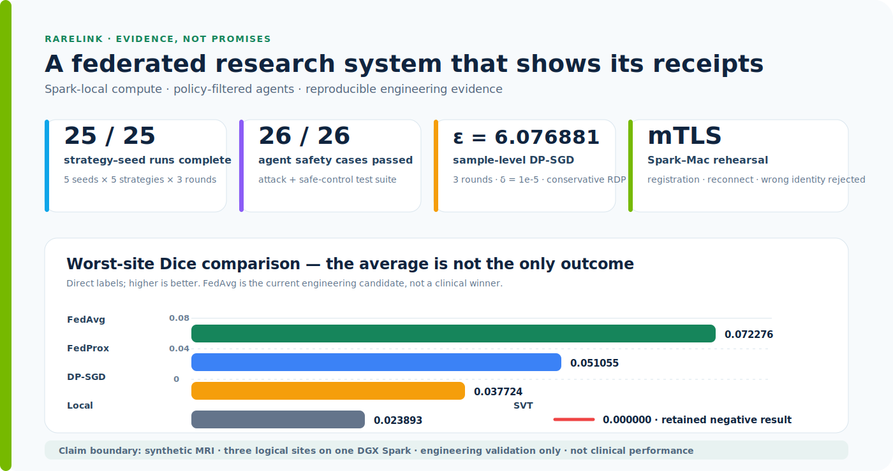
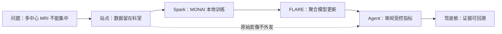

# RareLink 稀联

<p align="center">
  <strong>中文</strong> · <a href="README.en.md">English</a>
</p>

<p align="center">
  <strong>把稀缺病例，变成可协作、可复核的研究证据。</strong><br/>
  DGX Spark × NVIDIA FLARE × MONAI × Step 3.7
</p>

<p align="center">
  
</p>

<p align="center">
  <a href="https://github.com/dingyucanada/RareLink/releases"></a>
  <a href="https://github.com/dingyucanada/RareLink/blob/main/LICENSE"></a>
  
  
  
</p>

> **一句话**：RareLink 把“数据不能集中”的多中心 MRI 研究，变成一条“数据留在科室、模型本地训练、证据跨站点协作、结果可审计”的科研工作流。

> 研究用途工程原型，不提供诊断或治疗建议。比赛验证在一台真实 DGX Spark 上完成三个逻辑站点；另有 Spark–Mac 两物理设备 mTLS 演练，但不等同于真实多医院生产部署。

## 30 秒看懂：我们交付的是证据闭环，不是一次性 Demo

<p align="center">
  
</p>

这张图复用路演 PPT 的实验叙事，直接呈现当前能够证明和不能证明的内容：FedAvg 是当前工程演示候选，因为它在本轮合成数据实验中具有最高的平均最弱站点 Dice（`0.072276`）；FedProx、严格 SVT 与 DP-SGD 的结果也完整保留，避免只展示“最好看”的曲线。它们是**合成数据、三逻辑站点、三轮训练**下的工程比较，不是临床性能或方法优越性结论。

| PPT 中的关键信息 | 首页可复核的答案 |
| --- | --- |
| 数据能否离开医院？ | 原始 MRI、标签和患者字段保持在站点；对外仅允许策略批准的模型更新与聚合统计。 |
| Spark 是否真的发挥本地算力？ | 已在 GB10 / ARM64 / CUDA 13 上完成 CUDA、MONAI 3D 训练、FLARE 聚合与 API/Web 服务。 |
| Agent 是否只是“聊天包装”？ | 五角色 Agent 只读取脱敏协议和聚合指标，受实验合同、输入/输出网关与人工审批约束。 |
| 结果是否可审计？ | 25/25 重复组合、26/26 红队、DP 会计、mTLS 收据与一键核验脚本均有对应入口。 |

## 为什么这个项目值得看

罕见病研究最难的部分，通常不是再训练一个模型，而是让多家医院在不交换患者原始数据的前提下，形成可复核、可解释、可继续迭代的研究证据。RareLink 将研究协议、站点可行性、实验合同、联邦训练、隐私审阅和科研报告组织成一个状态机，并把每次决策写入审计账本。

| 研究者看到的价值 | 系统提供的机制 |
| --- | --- |
| 数据不出科室 | 站点本地 NIfTI / 标签处理；对外只发送模型更新与策略允许的聚合统计 |
| 不被平均数掩盖 | 同时比较平均 Dice、最弱站点 Dice、站点差异和 HD95 |
| Agent 不越权 | 输入脱敏、输出门控、人工审批、锁定实验合同和 26 项安全红队 |
| 结果可以复现 | 5 种子 × 5 策略 × 3 轮、mTLS 收据、DP 会计和一键证据校验 |

## 文档与研究入口

| 想了解什么 | 直接查看 |
| --- | --- |
| 今天完成了哪些 Spark 移植与实验 | [DGX Spark 系统移植与实机实验正式报告](outputs/RareLink-2026-07-17-DGX-Spark系统移植与实机实验正式报告.md) |
| 25 次五种子、多轮实验的结论 | 同上第 5 节；`5 × 5` 策略—种子组合全部完成 |
| 样本级 DP-SGD、两设备 mTLS、Agent 红队 | 同上第 6–8 节 |
| 架构、数据边界与组件职责 | [系统架构](docs/architecture.md) |
| Spark 复现与部署步骤 | [部署手册](docs/deployment.md) |
| 不下载数据也能启动的评审一键包 | [评审一键复现包](DEMO.md) |
| 最终提交映射与待办 | [最终提交清单](outputs/RareLink-最终提交清单.md) |
| NVIDIA / Step 技术栈说明 | [技术栈说明](outputs/RareLink-技术栈说明.md) |
| 三分钟现场演示流程 | [演示视频脚本](outputs/RareLink-三分钟演示视频脚本.md) |
| 路演 PPT 双语内容 | [Bilingual pitch deck](outputs/RareLink-路演PPT双语内容.md) |
| 从比赛到企业的下一步 | [企业化一页路线图](outputs/RareLink-企业化一页路线图.md) |
| DGX Spark 黑客松开发历程 | [黑客松十日谈](outputs/RareLink-DGX-Spark黑客松十日谈.md) |
| 技术、术语与数据权威资料 | [参考资料](docs/references.md) |

### 实机证据摘要

| 维度 | 已验证事实 | 应避免的夸大 |
| --- | --- | --- |
| 本地算力 | DGX Spark GB10 上完成 CUDA kernel、MONAI 3D 训练、FLARE 聚合、前后端服务 | 不宣称临床模型性能 |
| 稳定性 | 5 种子 × 5 策略 × 3 轮，25/25 完成；FedAvg 的最弱站点胜率为 40% | 不用五个合成种子做医学统计推断 |
| 隐私 | Opacus 样本级 DP-SGD，三轮保守会计 `ε=6.076881`、`δ=1e-5` | 不宣称端到端、用户级或医院级 DP 保证 |
| 通信 | Spark–Mac mTLS 首次注册、重连成功，错误身份拒绝 | 不宣称真实医院 WAN/生产身份验证 |
| Agent 安全 | 输入/输出双向网关；26/26 红队与控制用例通过 | 不宣称完整渗透测试或医疗安全认证 |
| 公开影像 I/O | Spark 验证一对官方 MNI152 结构 MRI/NIfTI 标签的几何与哈希回执 | 不把该单对公开模板说成肿瘤基准或联邦效果 |

### 评委 90 秒路径

如果时间有限，按下面顺序即可判断项目是否完整：



1. 看首屏插图：理解数据边界、Spark 位置和 Agent 位置。
2. 看“实机证据摘要”：确认 25/25、DP-SGD、mTLS 和 26/26 红队不是口号。
3. 运行 [评审一键复现包](DEMO.md)：不下载影像即可核验四个证据门。
4. 最后看 [正式实机报告](outputs/RareLink-2026-07-17-DGX-Spark系统移植与实机实验正式报告.md)：查看过程、结果、推理和限制。

<details>
<summary>比赛评审标准映射（展开查看）</summary>

### 100 分评审映射

| 权重 | 首页上的答案 | 证据入口 |
| ---: | --- | --- |
| 25% 实用性 / 创新性 | 面向小样本、多中心 MRI 的数据本地化科研闭环 | [项目说明](outputs/RareLink-比赛项目说明.md) |
| 25% Agent / 模型深度 | 五角色 Agent、Local/Step/Template 路由、DP-SGD、红队与人工审批 | [技术栈说明](outputs/RareLink-技术栈说明.md) |
| 20% 完整性 | 前端、API、账本、训练、复现脚本、Release | [DEMO.md](DEMO.md) |
| 15% 平台适配 | DGX Spark GB10、CUDA、MONAI、NVIDIA FLARE | [部署手册](docs/deployment.md) |
| 10% 演示 | 3 分钟脚本 + 两段短证据素材 | [视频脚本](outputs/RareLink-三分钟演示视频脚本.md) |
| 5% 十日谈 | 开发历程已成稿，待发布外链 | [黑客松十日谈](outputs/RareLink-DGX-Spark黑客松十日谈.md) |

</details>

## 技术生态与数据来源

| 类别 | 采用 / 来源 | 说明 |
| --- | --- | --- |
| 本地算力 | [NVIDIA DGX Spark](https://www.nvidia.com/en-us/products/workstations/dgx-spark/) · [User Guide](https://docs.nvidia.com/dgx/dgx-spark/index.html) | GB10 / ARM64 节点承载本地影像训练、FLARE Client 和服务。 |
| GPU 软件 | [CUDA](https://developer.nvidia.com/cuda) · [PyTorch](https://pytorch.org/) | CUDA 张量计算、AMP、AdamW 与模型运行时。 |
| 本地 Agent 推理 | [NVIDIA TensorRT-LLM](https://github.com/NVIDIA/TensorRT-LLM) · [DGX Spark 实操](https://build.nvidia.com/spark/trt-llm) | 可选 Spark 本地 OpenAI 兼容端点；默认面向 Nemotron 120B NVFP4。含元数据回执、独立核验、26 条本地网关红队与 `1/2/4` 安全并发基准；未有真实回执时明确 `NOT CLAIMED`。 |
| 联邦学习 | [NVIDIA FLARE](https://nvidia.github.io/NVFlare/) · [GitHub](https://github.com/NVIDIA/NVFlare) | FedAvg/FedProx、Client API、mTLS 和联邦模拟/演练。 |
| 医学影像 | [Project MONAI](https://project-monai.github.io/) · [MONAI Docs](https://docs.monai.io/) | NIfTI、三维 SegResNet、影像变换和评估。 |
| 隐私训练 | [Opacus](https://opacus.ai/) | 样本级 DP-SGD、逐样本裁剪、噪声与 RDP 会计。 |
| 联邦学习术语 | [NIST Glossary](https://csrc.nist.gov/glossary/term/federated_learning) | 联邦学习的权威定义与边界；联邦学习不自动等于合规。 |
| 罕见病术语 | [NIH GARD](https://rarediseases.info.nih.gov/diseases/pages/31/faqs-about-rare-diseases) | 美国语境下的罕见病定义；本项目不据此宣称诊断或流行病学结论。 |
| 公开研究基准 | [MSD](https://medicaldecathlon.com/) · [TCIA BraTS-PEDs](https://www.cancerimagingarchive.net/collection/brats-peds/) | MSD 下载器已实现；BraTS-PEDs 是计划中的合规外部验证来源，不包装为当前已完成训练结果。 |

完整版本、DOI、许可证、数据使用政策和当前验证状态见[参考资料](docs/references.md)。

## Current milestone

当前端到端里程碑包括：

- FastAPI + SQLModel study API;
- a persistent research state machine and audit ledger;
- Step 3.7 client with a deterministic template fallback;
- a five-role Step 3.7 Agent Team with structured, separately audited artifacts;
- aggregate-data egress policy with small-group suppression;
- React research console and exportable research evidence bundle;
- synthetic three-site, four-modal NIfTI cohort generation;
- MSD Task01 public brain-tumour benchmark downloader with archive/file hashes and deterministic
  three-site non-IID partitioning;
- real MONAI 3D SegResNet single-site training;
- real NVIDIA FLARE 2.7.2 three-site FedAvg and FedProx simulation.
- persisted real training jobs with live progress, logs, Dice/HD95, and global-model evidence.
- resumable aligned Local/FedAvg/FedProx/SVT/DP-SGD experiment matrices with Student-t intervals
  and worst-site win rates;
- NVIDIA FLARE mTLS provisioning plus token-free three-client registration evidence;
- a real NVIDIA FLARE `SVTPrivacy` update-filter comparison with explicit accounting limits;
- Opacus sample-level DP-SGD with per-sample clipping, Poisson sampling, RDP composition across
  FLARE rounds, and explicit `(epsilon, delta)` claim boundaries;
- a deterministic 26-case Agent red team enforced before and after Step 3.7;
- two-device mTLS evidence tooling for registration, dropout/reconnect, and wrong-identity rejection;
- local-only four-modal synthetic MRI and segmentation overlays that reject patient-data manifests.
- a Spark-local TensorRT-LLM adapter with `spark_local` / `step_remote` / `hybrid` routing, metadata-only
  inference receipts, independent verifier, 26-case local gateway red-team tooling, and a fixed safe
  `1 / 2 / 4` concurrency profiler; the UI remains `NOT CLAIMED` until real local-model evidence is captured.

真实训练链路已在本地 CPU 完成工程冒烟验证：三逻辑院区均参与聚合并生成全局模型。控制台
支持 `mock` 与 `nvflare` 两种显式模式；比赛配置已切换到真实任务模式，开源默认仍为 mock，
两者不会混淆或冒充临床结论。

2026-07-16 至 2026-07-17，项目已在真实 NVIDIA DGX Spark GB10 上完成 CUDA MONAI 训练、
三逻辑站点 NVFLARE 聚合、API 后台任务和公网前后端映射，并完成五种子多轮矩阵、样本级
DP-SGD、Spark–Mac 两设备 mTLS 与 Agent 红队。完整的环境、过程、结果、推理和限制见
[DGX Spark 系统移植与实机实验正式报告](outputs/RareLink-2026-07-17-DGX-Spark系统移植与实机实验正式报告.md)。
所有结果仍属于单机逻辑站点与合成数据的工程验证，不代表真实多院部署或临床有效性。

Step Plan 的 `step-3.7-flash` Models API 权限与真实 JSON-mode 协议生成也已完成冒烟验证；
实验设计、统计评审、隐私评审和科研写作四角色串行协作也已通过真实 API 验证。测试输入为
完全合成的研究题目和聚合指标，不包含患者数据。

See [the implementation specification](outputs/RareLink-项目开发规格书.md) for the complete roadmap.
The latest Spark evidence is recorded in
[the four-upgrade validation report](outputs/RareLink-四项获奖升级实机报告.md).

## Reviewer quick start

The review package starts the console without downloading medical images, model weights, certificates,
or API keys. It seeds a clearly labelled, token-free evidence snapshot only when the local runtime
does not already have Spark artifacts, then verifies the four competition evidence gates.

```bash
sudo docker compose -f deploy/compose.spark.yml up --build -d
sudo docker compose -f deploy/compose.spark.yml exec api python3 scripts/verify_demo_evidence.py --artifact-root artifacts --write
```

For local development without containers, run `bash scripts/review_demo.sh`. Read [DEMO.md](DEMO.md) for
the exact proof boundary, the expected four checks, and optional commands that consume GPU time. The
snapshot is for review rendering, never overwrites fresh runtime evidence, and is not presented as a
newly executed experiment.

## Local development

```bash
cp .env.example .env
python3 -m venv .venv
. .venv/bin/activate
make install
make install-web
make dev-api
```

In another terminal:

```bash
make dev-web
```

Open `http://localhost:5173`. API docs are at `http://localhost:8000/docs`.

The app uses a safe template agent when `STEP_API_KEY` is empty. Set the key only in `.env`; never
commit it.

## Tests

```bash
make test
make lint
npm run test:web
npm run build
```

## Real federated-learning smoke run

安装医学影像与联邦学习依赖：

```bash
.venv/bin/python -m pip install -e '.[dev,spark]'
```

生成非临床合成数据，并分别运行单站点 MONAI、三站点 FedAvg 与 FedProx：

```bash
.venv/bin/python scripts/prepare_demo_data.py --output data/runtime/synthetic-demo-v1
.venv/bin/python scripts/train_monai_smoke.py --manifest data/runtime/synthetic-demo-v1/manifest.json --site site-a --epochs 1
.venv/bin/python scripts/run_nvflare_simulation.py --manifest data/runtime/synthetic-demo-v1/manifest.json --strategy fedavg --rounds 1 --local-epochs 1 --workspace artifacts/nvflare-fedavg
.venv/bin/python scripts/run_nvflare_simulation.py --manifest data/runtime/synthetic-demo-v1/manifest.json --strategy fedprox --rounds 1 --local-epochs 1 --workspace artifacts/nvflare-fedprox
.venv/bin/python scripts/run_nvflare_simulation.py --manifest data/runtime/synthetic-demo-v1/manifest.json --strategy fedavg_dpsgd --rounds 3 --local-epochs 1 --dp-noise-multiplier 1.2 --dp-max-grad-norm 1.0 --dp-delta 0.00001 --workspace artifacts/nvflare-dpsgd
```

`fedavg_dpsgd` uses Opacus expanded-weights gradients because MONAI SegResNet contains residual
operations that are incompatible with hook-mode per-sample gradients. Empty Poisson draws perform no
optimizer update but are conservatively counted in server-side RDP composition. The resulting budget
covers sample-level local training only; it is not a user-level, institution-level, transport, or
clinical privacy guarantee.

Run the formal aligned matrix with interruption-safe resume:

```bash
python3 scripts/run_repeated_benchmark.py \
  --manifest data/runtime/synthetic-demo-v1/manifest.json \
  --seeds 2026 2027 2028 2029 2030 \
  --strategies local fedavg fedprox fedavg_svt fedavg_dpsgd \
  --rounds 3 --local-epochs 1 \
  --dp-noise-multiplier 1.2 --dp-max-grad-norm 1.0 --dp-delta 0.00001 \
  --resume --workspace artifacts/repeated-benchmark
```

The Local baseline automatically trains for `rounds × local_epochs` so every strategy receives the
same number of local epoch opportunities. If an older workspace contains under-trained Local records,
replace only those records with `--resume --rerun-strategies local`.

## Agent safety evidence

The deterministic gateway redacts patient identifiers, raw-image fields, DICOM UIDs, medical file
paths, contact data, credentials, and small groups before Step 3.7. Structured output is blocked if it
contains diagnosis/treatment directives, requests patient data, makes clinical-validation claims, or
tries to escalate the locked data-egress contract.

```bash
python3 scripts/run_agent_redteam.py
```

The checked-in suite contains 26 attack and safe-control cases. Its result is a bounded engineering
evaluation, not a complete penetration test or medical-safety certification.

## Public benchmark evidence

To create stronger competition evidence, download the public MSD Task01_BrainTumour archive directly
on the Spark node — never through SSH/SCP. The preparation script verifies the published archive MD5,
writes archive and selected-file hashes, and simulates three non-IID sites by tumour-volume quantile.
This is a public research benchmark, not rare-disease data or a clinical validation set.

```bash
python scripts/prepare_msd_brain_tumour.py \
  --data-root data/raw/msd-task01 \
  --output data/runtime/msd-brain-tumour-v1 \
  --cases-per-site 8

# Local baselines: site-a, site-b, site-c; centralized is a research-only upper bound.
python scripts/train_monai_smoke.py --manifest data/runtime/msd-brain-tumour-v1/manifest.json --site centralized --epochs 2 --output artifacts/msd-centralized
python scripts/run_nvflare_simulation.py --manifest data/runtime/msd-brain-tumour-v1/manifest.json --strategy fedavg --rounds 3 --workspace artifacts/msd-fedavg
python scripts/run_nvflare_simulation.py --manifest data/runtime/msd-brain-tumour-v1/manifest.json --strategy fedprox --fedprox-mu 0.01 --rounds 3 --workspace artifacts/msd-fedprox
```

The MSD Task01 label value `3` (enhancing tumour) is explicitly merged into value `2` so the shared
three-class background/edema/tumour contract remains stable. Read the operational and data-handling constraints in
[the deployment guide](docs/deployment.md#7-公开脑肿瘤基准直连下载与可复现实验).

## Spark deployment

不要通过 SSH 上传大数据。应在节点上克隆仓库，先只读检查 ARM64、CUDA、Docker、统一内存和
磁盘环境，再运行 GPU 冒烟验证。完整步骤见 [DGX Spark 部署手册](docs/deployment.md)。

推荐使用可复现的 Spark 容器配置：

```bash
docker build -f deploy/Dockerfile.spark -t rarelink-spark:latest .
docker run --rm --gpus all rarelink-spark:latest python3 scripts/smoke_runtime.py
```
