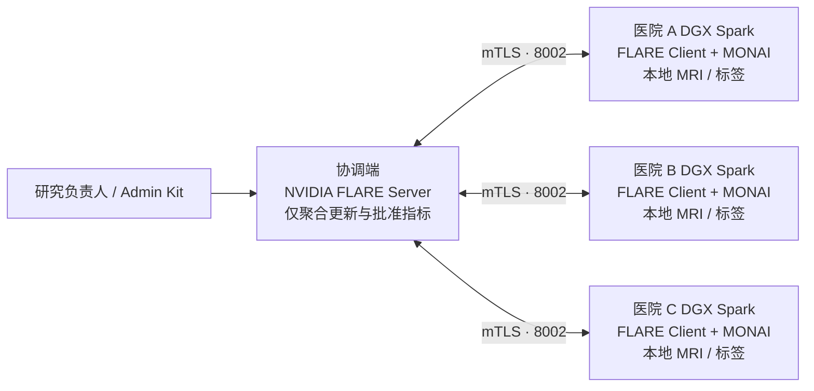

# RareLink 三物理 DGX Spark 联邦部署手册

> **研究用途软件，不是医疗器械。** 本手册把 RareLink 从“单 Spark 三逻辑站点”升级为三台独立 Spark 的真实联邦工程部署。它不替代医院网络安全评估、伦理审批、数据使用协议、DPIA/等保、渗透测试、临床验证或医疗器械注册。

本文是现场部署操作手册。正式产品范围、接口、状态机、安全、测试和分级验收以 [正式工程开发计划](engineering-development-plan.md) 为准；关键不可变边界见：

- [ADR-0001：物理联邦控制面与模拟路径隔离](adr/0001-physical-federation-control-plane.md)
- [ADR-0002：站点身份、证书与院内数据边界](adr/0002-site-identity-and-data-boundary.md)
- [ADR-0003：任务幂等、固定参与方与 Quorum](adr/0003-idempotency-and-quorum.md)
- [医院本地 NIfTI 数据规范](site-data-manifest.md)
- [物理控制面防篡改审计设计与验收](physical-audit.md)
- [物理控制面 OIDC 身份与 RBAC 设计](physical-identity-rbac.md)
- [物理联邦合同锁定与双人审批](physical-dual-approval.md)
- [物理控制面站点资源级授权](physical-site-scope.md)

## 1. 目标拓扑与不可变边界



- 协调端只持有经审批的作业包、参与方身份、模型更新、全局模型与受合同约束的聚合指标；**不能挂载医院影像盘**。
- 每台 Spark 仅挂载自己的 NIfTI、标签与 `manifest.json`，MONAI 训练在本地 GPU 执行。
- Agent 只消费脱敏协议和获批准的聚合结论；不连接影像目录、FLARE 私钥或管理员启动包。
- 启动包由 NVIDIA FLARE Provisioning 生成并签名。不得手工编辑 `startup/fed_client.json` 或 `fed_server.json`。

## 2. 工程交付物

| 交付物 | 位置 | 用途 |
| --- | --- | --- |
| 中心拓扑模板 | `deploy/physical/topology.example.yml` | 三个物理站点和协调端的非敏感身份/FQDN |
| 站点运行模板 | `deploy/physical/site-runtime.example.yml` | **仅本院保留**的 manifest、工件和 kit 路径 |
| 渲染与 Provisioning | `scripts/render_physical_federation.py` | 生成给 `nvflare provision` 签名的 `project.yml` |
| 站点预检 | `scripts/validate_physical_site.py` | 验证本站数据归属、kit、GPU、CLI 与协调端连通性 |
| 真实作业导出 | `scripts/export_physical_nvflare_job.py` | 导出 FedAvg/FedProx job，不打包数据、证书或私钥 |
| 受控提交 | `scripts/submit_physical_nvflare_job.py` | 只在协调方持有 Admin Kit 的主机执行 |
| 本地训练客户端 | `scripts/nvflare_monai_client.py` | MONAI 本地训练；物理模式拒绝包含外站病例的 manifest |
| 医院 Site Agent | `scripts/run_site_agent.py` | 每站独立预检、幂等任务、签名心跳与本地收据 |
| 中心心跳转发 | `scripts/push_site_heartbeat.py` | 将患者信息为零的签名状态转发到协调面 |
| 中心物理控制 API | `/api/physical/*` | 站点登记、作业审批、提交、同步、停止、重试、恢复与模型核验 |
| 三进程验收 | `scripts/smoke_three_site_control_plane.py` | 设备到位前验证三个独立站点进程及 3/3 合同 |

## 3. 前置治理与网络条件

各参与方需确认研究协议、目标、训练轮数、站点名单、退出条件、最小分组、更新/指标的可发布范围、日志保留期、密钥轮换与安全事件流程。联邦学习本身不构成合规承诺。

网络应满足：协调端有被各院批准访问的内部 FQDN；Server 的 `8002/tcp`（训练）与 `8003/tcp`（管理员）按最小必要原则开放；Client 仅需到协调端的出站连接；每台 Spark 使用独立本地工作区。mTLS 解决身份与传输保护，不自动抵御恶意 Client、模型投毒、成员推断或模型反演。

## 4. 渲染中心拓扑并生成签名包

在受控的协调方操作机复制模板，填入已由各院 IT 批准的内部 DNS 名称和组织标识。不要填公网 IP、SSH 端口、数据路径、设备序列号、密钥或任何患者信息：

```bash
cp deploy/physical/topology.example.yml deploy/physical/topology.yml
python3 scripts/render_physical_federation.py \
  --topology deploy/physical/topology.yml \
  --output-dir deploy/physical/rendered
```

`project.yml` 是唯一允许交给 NVIDIA FLARE Provisioning 的拓扑源；`deployment-receipt.json` 可进入审计包，且不含患者数据、证书或私钥。

由授权管理员在隔离的协调方环境继续：

```bash
python3 -m pip install -e '.[spark]'
python3 scripts/render_physical_federation.py \
  --topology deploy/physical/topology.yml \
  --output-dir deploy/physical/rendered \
  --workspace deploy/physical/provisioned \
  --provision
```

NVIDIA FLARE 将生成 server、三个 client 和 admin 的独立签名包。只把 `hospital-a` 的 Client kit 交给医院 A，B、C 同理；Admin kit 永远留在协调方。`provisioned/` 不得提交 Git、上传演示服务器、共享对象桶或聊天工具。

## 5. 每家医院配置自己的 Spark

每台 Spark 从批准的软件源获取 RareLink，不通过 SSH 传影像。以非 root 的 `rarelink` 服务账号解压本院 kit，并创建只留在本机的运行文件：

```yaml
site_id: hospital-a
dataset_manifest: /srv/rarelink/site-data/manifest.json
dataset_root: /srv/rarelink/site-data
dataset_receipt: /var/lib/rarelink/site-agent/dataset-receipt.json
artifact_root: /var/lib/rarelink/artifacts
startup_kit: /opt/rarelink/flare/hospital-a
required_free_memory_percent: 15
```

`dataset_manifest` 只能包含本院病例，且每条 `site_id` 必须等于本院 site ID。
先在医院本地生成数据版本证明，再运行站点预检：

```bash
python3 scripts/validate_site_dataset.py \
  --manifest /srv/rarelink/site-data/manifest.json \
  --data-root /srv/rarelink/site-data \
  --site-id hospital-a \
  --output /var/lib/rarelink/site-agent/dataset-receipt.json

python3 scripts/validate_physical_site.py \
  --topology deploy/physical/topology.yml \
  --site-runtime /etc/rarelink/site-runtime.yml \
  --output /var/lib/rarelink/artifacts/site-preflight.json
```

数据验证会检查四模态完整性、NIfTI 文件约束、shape/affine/orientation/spacing、
标签整数与取值合同、外站记录、路径越界和直接标识字段，并对 manifest 与文件
内容形成数据指纹。预检回执只记录本地病例数量、数据/manifest/回执哈希、GPU
是否可用和 TCP 连通性；不记录病例 ID、路径、影像或标签。数据文件或 manifest
改变后，Site Agent 会把旧证明标记为失效；物理作业绑定三个站点的数据指纹，
变更后必须创建并重新批准合同。TCP 可达不等同 mTLS 注册成功。

使用 `deploy/physical/rarelink-flare.service.template` 建立 systemd 服务，或在受控会话先启动 Server、再启动三台 Client 的 `startup/start.sh`。每台 Spark 通过相同逻辑路径 `/srv/rarelink/site-data/manifest.json` 加载数据，但路径实际指向完全不同的本地数据卷。

### 5.1 启动医院本地 Site Agent

每台 Spark 复制 `deploy/physical/site-agent.env.example` 到
`/etc/rarelink/site-agent.env`，只填写本站路径和由医院密钥系统生成的随机值。
该文件应归 `root:rarelink` 所有并设置为 `0640`，不得提交 Git 或复制到协调端。

安装 `deploy/physical/rarelink-site-agent.service.template` 后，先在本机核验：

```bash
curl http://127.0.0.1:9100/health/live
curl -H "Authorization: Bearer ${RARELINK_SITE_AGENT_API_TOKEN}" \
  http://127.0.0.1:9100/v1/site/ready
```

`/health/live` 只说明进程存活；`/v1/site/ready` 才同时检查 GPU、磁盘、内存、
MONAI、NVFLARE、证书、manifest 和启动包。任何必要检查失败时，站点不得被
视为可训练。任务接口为 `/v1/tasks/start`、`/v1/tasks/stop` 和
`/v1/tasks/recover`，以 `task_id + round_id + contract_sha256` 保证幂等；
进程中断时采用失败关闭，必须显式恢复。

### 5.2 向中心发送签名心跳

协调端先设置三个 Site ID 对应的 HMAC 密钥和独立操作员凭据：

```bash
RARELINK_PHYSICAL_MODE=physical
RARELINK_PHYSICAL_AUTH_MODE=oidc
RARELINK_PHYSICAL_SITE_SECRETS='{"hospital-a":"...","hospital-b":"...","hospital-c":"..."}'
RARELINK_AUDIT_HMAC_KEY='由受控密钥系统注入的至少 32 字符随机值'
RARELINK_OIDC_ISSUER='https://identity.hospital.example'
RARELINK_OIDC_AUDIENCE='rarelink-physical-control'
RARELINK_OIDC_JWKS_JSON='{"keys":[...已核验验证公钥...]}'
RARELINK_OIDC_ROLES_CLAIM=roles
RARELINK_OIDC_ORGANIZATION_CLAIM=organization
RARELINK_OIDC_SITES_CLAIM=site_ids
RARELINK_NVFLARE_ADMIN_KIT=/opt/rarelink/admin/research-admin
```

每站的 `RARELINK_SITE_AGENT_RECEIPT_HMAC_KEY` 必须与协调端该 Site ID 的值
一致。使用
`deploy/physical/rarelink-site-heartbeat-forwarder.service.template`
持续转发，或先做一次人工核验：

```bash
python3 scripts/push_site_heartbeat.py \
  --agent-url http://127.0.0.1:9100 \
  --coordinator-url https://rarelink-coordinator.example.org
```

转发器从环境读取 Site Agent token，不把 token、HMAC 密钥、患者信息或本地
路径放入请求体和输出。中心验证签名、时间窗口和 heartbeat ID 去重；过期或
重复心跳被拒绝。`RARELINK_PHYSICAL_MODE` 默认为 `disabled`；三独立进程
验收必须设置为 `isolated-integration`，只有完成现场配置与授权后才设置为
`physical`，该模式会随站点和作业 API 一起显示在前端。

`physical` 模式对审计密钥执行硬门：未配置至少 32 字符的
`RARELINK_AUDIT_HMAC_KEY` 时，受保护物理写操作返回 `503`，不会回退为无密钥
SHA-256 事件。长度门不验证随机熵；真实部署必须由 Vault/KMS 等受控密钥系统
生成和注入，并与数据库、备份和日志分离。

`physical` 模式同时强制 `RARELINK_PHYSICAL_AUTH_MODE=oidc`。操作员使用
`Authorization: Bearer <OIDC access token>`；共享
`X-RareLink-Operator-Token` 即使配置也会被拒绝。当前 Adapter 只使用环境
JSON 注入的受信内存 JWKS，支持 RS256/ES256，并校验 issuer、audience、时间、
sub、角色、组织和站点 claims。JWT/raw claims 不持久化、不写审计。

`legacy-token` 仅允许 `isolated-integration`，不能用于真实医院或公网。当前
尚无 discovery/HTTPS JWKS 拉取、自动缓存轮换、MFA 和会话吊销；OIDC/JWKS 详情见
[物理控制面 OIDC/RBAC 文档](physical-identity-rbac.md)。

OIDC 主体的 `site_ids` 是资源级硬门：站点登记检查目标站点；合同创建、第二
审批、submit、sync、abort、retry/resume 和 verify-model 要求作业全部三站均
为 claims 子集。检查发生在 NVIDIA FLARE/模型操作之前；403 不回显缺失站点。
`isolated-integration` 的 legacy 路径会绕过该检查，不能作为 scope 证据。公开
site/job list 和全局 audit read 当前未按站点过滤，见
[站点资源级授权](physical-site-scope.md)。

Site Agent 的执行后端同样默认 `disabled`，因此未完成现场授权时，任务接口
会失败关闭。医院 IT 可设置
`RARELINK_SITE_AGENT_EXECUTOR_BACKEND=systemd`，并只授权 `rarelink` 服务
账号对固定的 `rarelink-flare-client.service` 执行
`start/stop/restart`。适配器不使用 shell，服务名经过白名单校验，API 请求不能
传入命令或 unit 名；`systemctl` 原始输出也不会进入回执。应通过最小权限的
polkit 规则完成授权，禁止赋予通用 sudo 或任意 systemd unit 控制权。

## 6. 导出、审阅、提交真实多站点作业

在协调方导出作业；它只包含代码、模型配置和逻辑数据路径：

```bash
python3 scripts/export_physical_nvflare_job.py \
  --topology deploy/physical/topology.yml \
  --strategy fedprox --fedprox-mu 0.01 \
  --rounds 3 --local-epochs 1 \
  --output-dir /var/lib/rarelink/jobs/pilot-fedprox
```

先审阅 `rarelink-job-receipt.json`：三家预期站点、`patient_data_packaged=false`、`certificates_packaged=false`、`local_only_manifest_required=true`。再由具有研究授权的管理员提交：

```bash
python3 scripts/submit_physical_nvflare_job.py \
  --admin-kit /opt/rarelink/admin/research-admin@rarelink.example.org \
  --job-dir /var/lib/rarelink/jobs/pilot-fedprox \
  --submit-token pilot-fedprox-001
```

`--submit-token` 是防止网络中断时重复提交的幂等标识，不是 API 密钥；回执会脱敏它。重试应复用同一个 token，不能盲目创建第二个作业。

同一能力也已接入 FastAPI 控制面：

- `POST /api/physical/sites`：由操作员登记三个预期站点；
- `POST /api/physical/sites/{site_id}/heartbeat`：接收站点签名心跳；
- `POST /api/physical/jobs`：校验导出包并进入人工审批；
- `POST /api/physical/jobs/{job_id}:approve`：由不同 OIDC `sub`、具有
  `physical.contract.approve` 的第二审批人确认固定 attestation；
- `POST /api/physical/jobs/{job_id}:submit|sync|abort|retry|resume`：控制并
  对账真实 NVIDIA FLARE Job ID；
- `POST /api/physical/jobs/{job_id}:verify-model`：只有作业已完成且三个
  指定站点均满足 quorum 时，才能绑定协调端全局模型 SHA-256。

所有写操作默认失败关闭。`physical` 模式缺少有效 OIDC 配置时返回 `503`，
token 无效返回 `401`，角色无权返回 `403`；错误响应不转发 token、raw claims、
NVFLARE 原始输出、Admin Kit 路径或凭据。`isolated-integration` 的 legacy
模式未配置 `RARELINK_PHYSICAL_OPERATOR_TOKEN` 时返回 `503`。

### 6.1 合同锁定与第二审批

`physical` 作业创建时计算 contract v1 SHA-256，覆盖 study、strategy、bundle、
排序后的三个站点、逐站数据指纹、rounds、local epochs 和固定 3-of-3 quorum。
提议人必须有 `physical.contract.create`；第二审批人必须有
`physical.contract.approve` 且 OIDC `sub` 不同。审批 attestation 固定为
`CONTRACT_DATA_AND_SECURITY_REVIEWED`，note 只保存 SHA-256，不保存明文。

同一主体、合同摘要和 attestation 的重试幂等；竞争审批返回 409。submit、retry、
resume 都会重新核验合同摘要和审批记录。公开 job view 只显示审批计数、状态和
合同摘要，不显示提议/审批主体。受保护审计记录第二审批，但不含 note 或 token。

`isolated-integration` 继续使用 `LEGACY_SINGLE_REQUEST`，不构成双人审批证据。
当前尚无审批撤销、过期、替补和提交动作双审；作业控制已强制三站 scope，
但公开列表/audit 过滤、组织/研究维度尚未完成。SQLite 多 worker 并发还需迁移
PostgreSQL。详见
[物理联邦合同锁定与双人审批](physical-dual-approval.md)。

### 6.2 物理控制面审计

每个已接受的站点登记、心跳、作业合同、提交、状态同步、停止、重试、恢复、
数据版本失效和模型核验操作都会追加规范化事件。事件通过 `previous_hash`
串联；试点历史可使用 SHA-256，配置密钥后的新事件使用 HMAC-SHA256。

- `GET /api/physical/audit-summary` 是公开最小摘要，只返回验证结论、事件总数、
  链头摘要、算法和更新时间，不返回 actor 或事件 payload；
- `GET /api/physical/events` 需要物理操作员身份，最多返回最近 200 条并明确
  `truncated`，不能作为长期审计归档；
- 任一链验证失败都应阻断正式作业提交、模型发布和研究报告导出。

当前 SQLite 审计链能检测篡改，但不是 WORM；尚未记录全部拒绝操作，没有旧
HMAC key-ring 轮换，多 worker 并发追加仍需 PostgreSQL 序列化。安全语义、
敏感字段边界、异常处置和完整验收方法见
[物理控制面审计文档](physical-audit.md)。

### 协调端存活与就绪

协调端应分别检查：

- `GET /api/health/live`：进程事件循环可响应；
- `GET /api/health/ready`：数据库可查询，且生产 schema 位于仓库 Alembic head。

负载均衡器和容器编排只应以 readiness 决定是否接收流量。readiness 返回 503 时，
不要把 liveness 成功误判为控制面可用。

## 7. 设备到位前的三独立进程验收

在开发机运行：

```bash
make physical-control-smoke
```

该验收启动三个独立的操作系统进程，每个进程创建不同 Site ID、本地状态库和
HMAC 签名心跳；协调进程逐一登记并验证心跳，再锁定一个 `3/3` 物理作业合同。
它验证的是控制协议、站点隔离、身份签名和固定 quorum，不运行医学训练，也不
宣称真实 NVIDIA FLARE 跨设备执行。设备到位后只替换各站地址、真实启动包和
本地 manifest，不修改业务协议。

## 8. 结果、运维与安全边界

MONAI Client 通过 FLARE 的 `FLModel.metrics` 回传合同中的 Dice、HD95、训练损失；本地批次、checkpoint、病例级指标与日志均留在医院。全局模型和聚合运行记录在协调方受控工作区。

发布前必须核对参与方、拓扑哈希、代码/作业包哈希、轮数、掉线和重连；报告平均值、最弱站点与站点差异；执行最小分组、DP 会计和小样本发布限制；并由人类 PI 批准。结果不构成诊断结论。

- **身份变更：** 修改 `topology.yml` 后重新 Provision；不可手改已签名 kit。
- **站点掉线：** 按锁定合同决定是否 abort；不能静默用两个站点替代既定三站点完成研究。
- **数据治理变更：** 停止该站 Client、撤销 kit、重新审批后才可恢复。
- **疑似泄露：** 终止作业，保全最小必要审计材料，并按各院事件响应流程处理。

## 9. 与竞赛原型的关系

此前实机版本验证的是单 Spark 三逻辑站点与两设备 mTLS 演练。本目录新增三台独立 Spark 的拓扑契约、kit 生成、站点本地数据验证、作业导出与管理员提交路径。它是可执行的现场试点工程基础；在三院分别完成网络、证书、数据治理和多轮运行前，项目不宣称已完成跨医院生产部署或临床有效性验证。

正式工程中的运行模式必须明确标记为 `simulation`、`isolated-integration` 或 `physical`。三容器集成可以验证控制协议，但不能作为物理跨院证据；只有通过正式工程开发计划 Level 2 验收的运行，才能声明完成三台物理 DGX Spark 工程验证。

## 参考资料

- [NVIDIA FLARE Provisioning](https://nvflare.readthedocs.io/en/main/programming_guide/provisioning_system.html)
- [NVIDIA FLARE Deployment Overview](https://nvflare.readthedocs.io/en/main/user_guide/admin_guide/deployment/overview.html)
- [NVIDIA FLARE Job CLI](https://nvflare.readthedocs.io/en/main/user_guide/nvflare_cli/job_cli.html)
- [MONAI](https://monai.io/)
