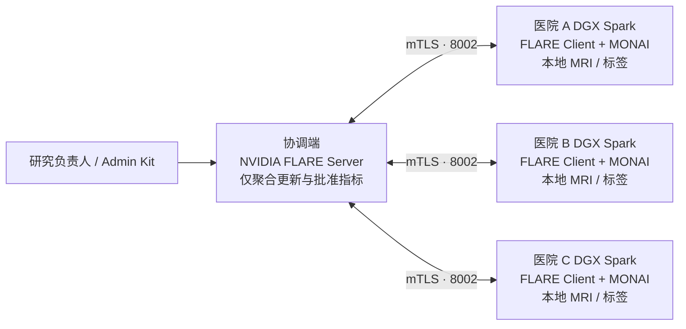

# RareLink 三物理 DGX Spark 联邦部署手册

> **研究用途软件，不是医疗器械。** 本手册把 RareLink 从“单 Spark 三逻辑站点”升级为三台独立 Spark 的真实联邦工程部署。它不替代医院网络安全评估、伦理审批、数据使用协议、DPIA/等保、渗透测试、临床验证或医疗器械注册。

## 1. 目标拓扑与不可变边界



- 协调端只持有经审批的作业包、参与方身份、模型更新、全局模型与受合同约束的聚合指标；**不能挂载医院影像盘**。
- 每台 Spark 仅挂载自己的 NIfTI、标签与 `manifest.json`，MONAI 训练在本地 GPU 执行。
- Agent 只消费脱敏协议和获批准的聚合结论；不连接影像目录、FLARE 私钥或管理员启动包。
- 启动包由 NVIDIA FLARE Provisioning 生成并签名。不得手工编辑 `startup/fed_client.json` 或 `fed_server.json`。

## 2. 工程交付物

| 交付物 | 位置 | 用途 |
| --- | --- | --- |
| 中心拓扑模板 | `deploy/physical/topology.example.yml` | 三个物理站点和协调端的非敏感身份/FQDN |
| 站点运行模板 | `deploy/physical/site-runtime.example.yml` | **仅本院保留**的 manifest、工件和 kit 路径 |
| 渲染与 Provisioning | `scripts/render_physical_federation.py` | 生成给 `nvflare provision` 签名的 `project.yml` |
| 站点预检 | `scripts/validate_physical_site.py` | 验证本站数据归属、kit、GPU、CLI 与协调端连通性 |
| 真实作业导出 | `scripts/export_physical_nvflare_job.py` | 导出 FedAvg/FedProx job，不打包数据、证书或私钥 |
| 受控提交 | `scripts/submit_physical_nvflare_job.py` | 只在协调方持有 Admin Kit 的主机执行 |
| 本地训练客户端 | `scripts/nvflare_monai_client.py` | MONAI 本地训练；物理模式拒绝包含外站病例的 manifest |

## 3. 前置治理与网络条件

各参与方需确认研究协议、目标、训练轮数、站点名单、退出条件、最小分组、更新/指标的可发布范围、日志保留期、密钥轮换与安全事件流程。联邦学习本身不构成合规承诺。

网络应满足：协调端有被各院批准访问的内部 FQDN；Server 的 `8002/tcp`（训练）与 `8003/tcp`（管理员）按最小必要原则开放；Client 仅需到协调端的出站连接；每台 Spark 使用独立本地工作区。mTLS 解决身份与传输保护，不自动抵御恶意 Client、模型投毒、成员推断或模型反演。

## 4. 渲染中心拓扑并生成签名包

在受控的协调方操作机复制模板，填入已由各院 IT 批准的内部 DNS 名称和组织标识。不要填公网 IP、SSH 端口、数据路径、设备序列号、密钥或任何患者信息：

```bash
cp deploy/physical/topology.example.yml deploy/physical/topology.yml
python3 scripts/render_physical_federation.py \
  --topology deploy/physical/topology.yml \
  --output-dir deploy/physical/rendered
```

`project.yml` 是唯一允许交给 NVIDIA FLARE Provisioning 的拓扑源；`deployment-receipt.json` 可进入审计包，且不含患者数据、证书或私钥。

由授权管理员在隔离的协调方环境继续：

```bash
python3 -m pip install -e '.[spark]'
python3 scripts/render_physical_federation.py \
  --topology deploy/physical/topology.yml \
  --output-dir deploy/physical/rendered \
  --workspace deploy/physical/provisioned \
  --provision
```

NVIDIA FLARE 将生成 server、三个 client 和 admin 的独立签名包。只把 `hospital-a` 的 Client kit 交给医院 A，B、C 同理；Admin kit 永远留在协调方。`provisioned/` 不得提交 Git、上传演示服务器、共享对象桶或聊天工具。

## 5. 每家医院配置自己的 Spark

每台 Spark 从批准的软件源获取 RareLink，不通过 SSH 传影像。以非 root 的 `rarelink` 服务账号解压本院 kit，并创建只留在本机的运行文件：

```yaml
site_id: hospital-a
dataset_manifest: /srv/rarelink/site-data/manifest.json
artifact_root: /var/lib/rarelink/artifacts
startup_kit: /opt/rarelink/flare/hospital-a
required_free_memory_percent: 15
```

`dataset_manifest` 只能包含本院病例，且每条 `site_id` 必须等于本院 site ID。运行预检：

```bash
python3 scripts/validate_physical_site.py \
  --topology deploy/physical/topology.yml \
  --site-runtime /etc/rarelink/site-runtime.yml \
  --output /var/lib/rarelink/artifacts/site-preflight.json
```

预检回执只记录本地病例数量、manifest 哈希、GPU 是否可用和 TCP 连通性；不记录病例 ID、路径、影像或标签。TCP 可达不等同 mTLS 注册成功。

使用 `deploy/physical/rarelink-flare.service.template` 建立 systemd 服务，或在受控会话先启动 Server、再启动三台 Client 的 `startup/start.sh`。每台 Spark 通过相同逻辑路径 `/srv/rarelink/site-data/manifest.json` 加载数据，但路径实际指向完全不同的本地数据卷。

## 6. 导出、审阅、提交真实多站点作业

在协调方导出作业；它只包含代码、模型配置和逻辑数据路径：

```bash
python3 scripts/export_physical_nvflare_job.py \
  --topology deploy/physical/topology.yml \
  --strategy fedprox --fedprox-mu 0.01 \
  --rounds 3 --local-epochs 1 \
  --output-dir /var/lib/rarelink/jobs/pilot-fedprox
```

先审阅 `rarelink-job-receipt.json`：三家预期站点、`patient_data_packaged=false`、`certificates_packaged=false`、`local_only_manifest_required=true`。再由具有研究授权的管理员提交：

```bash
python3 scripts/submit_physical_nvflare_job.py \
  --admin-kit /opt/rarelink/admin/research-admin@rarelink.example.org \
  --job-dir /var/lib/rarelink/jobs/pilot-fedprox \
  --submit-token pilot-fedprox-001
```

`--submit-token` 是防止网络中断时重复提交的幂等标识，不是 API 密钥；回执会脱敏它。重试应复用同一个 token，不能盲目创建第二个作业。

## 7. 结果、运维与安全边界

MONAI Client 通过 FLARE 的 `FLModel.metrics` 回传合同中的 Dice、HD95、训练损失；本地批次、checkpoint、病例级指标与日志均留在医院。全局模型和聚合运行记录在协调方受控工作区。

发布前必须核对参与方、拓扑哈希、代码/作业包哈希、轮数、掉线和重连；报告平均值、最弱站点与站点差异；执行最小分组、DP 会计和小样本发布限制；并由人类 PI 批准。结果不构成诊断结论。

- **身份变更：** 修改 `topology.yml` 后重新 Provision；不可手改已签名 kit。
- **站点掉线：** 按锁定合同决定是否 abort；不能静默用两个站点替代既定三站点完成研究。
- **数据治理变更：** 停止该站 Client、撤销 kit、重新审批后才可恢复。
- **疑似泄露：** 终止作业，保全最小必要审计材料，并按各院事件响应流程处理。

## 8. 与竞赛原型的关系

此前实机版本验证的是单 Spark 三逻辑站点与两设备 mTLS 演练。本目录新增三台独立 Spark 的拓扑契约、kit 生成、站点本地数据验证、作业导出与管理员提交路径。它是可执行的现场试点工程基础；在三院分别完成网络、证书、数据治理和多轮运行前，项目不宣称已完成跨医院生产部署或临床有效性验证。

## 参考资料

- [NVIDIA FLARE Provisioning](https://nvflare.readthedocs.io/en/main/programming_guide/provisioning_system.html)
- [NVIDIA FLARE Deployment Overview](https://nvflare.readthedocs.io/en/main/user_guide/admin_guide/deployment/overview.html)
- [NVIDIA FLARE Job CLI](https://nvflare.readthedocs.io/en/main/user_guide/nvflare_cli/job_cli.html)
- [MONAI](https://monai.io/)
