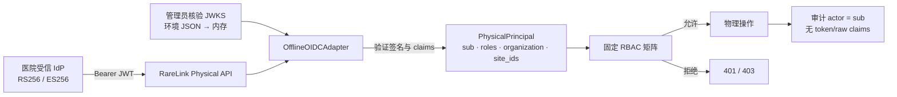

# RareLink 物理控制面 OIDC 身份与 RBAC 设计

**状态：** P1 Increment Implemented  
**范围：** RareLink 物理联邦控制面的操作员 API  
**实现：** `rarelink/security/oidc.py`、`rarelink/security/physical_rbac.py`  
**定位：** 受信内存 JWKS 的离线 JWT 验证和动作级 RBAC；尚不是完整医院 IAM 集成

> 当前实现能够验证由预先信任密钥签发的 OIDC JWT，并按固定角色—权限矩阵失败关闭。物理合同的独立第二审批已持久化，目标明确的控制操作强制 `site_ids` 全目标站点子集；physical 模式下站点、作业和审计明细读取也已认证并按同一 scope 过滤。但 OIDC discovery、远程 JWKS 生命周期、MFA、会话吊销、组织/研究成员关系以及提交/恢复动作本身的双人批准仍未完成。真实医院部署仍需 IAM、安全和合规验收。

## 1. 已实现范围

- `OfflineOIDCAdapter` 只接收预先信任、已加载到内存的 JWKS，不访问网络；
- 只允许 RS256 和 ES256；
- 校验签名、`iss`、`aud`、`exp`、`iat`、可选 `nbf` 和 `sub`；
- 校验可配置的角色、组织、站点 claim；
- 将验证结果最小化为 `PhysicalPrincipal`；
- 五个固定角色、十种固定权限，未知角色和未知动作失败关闭；
- `physical` 模式强制 OIDC Bearer 身份，拒绝 legacy operator token；
- `legacy-token` 仅保留给 `isolated-integration` 三进程/三容器验收；
- OIDC access token、refresh token 和 raw claims 不持久化、不进入审计；
- 已接受操作的审计 actor 只记录已验证的 issuer-scoped `sub`。

## 2. 信任模型



当前假设：

1. `RARELINK_OIDC_JWKS_JSON` 在进入进程前已经核验来源；
2. issuer 与 audience 由医院 IAM 和 RareLink 管理员共同固定；
3. 私钥只留在 IdP，RareLink 只持有验证公钥；
4. JWT 经 TLS 传输，代理和应用日志不记录 Authorization header；
5. 角色与组织 claim 由医院身份治理流程负责；
6. 环境 JWKS 更新需要受控重启/重载，并非自动在线轮换。

## 3. OfflineOIDCAdapter 验证契约

### 3.1 算法与 JWK

| 项目 | 规则 |
| --- | --- |
| RS256 | JWK `kty` 必须为 `RSA` |
| ES256 | JWK `kty` 必须为 `EC` |
| `kid` | 必须存在、非空、最长 128 字符，并在 JWKS 中唯一匹配 |
| `alg` | 只允许 RS256/ES256；JWK 声明的算法必须一致 |
| `use` | 缺省或 `sig` |
| `key_ops` | 缺省或包含 `verify` |
| token | 非空、无首尾空格、最长 16,384 字符 |

`none`、HS256、未知算法、未知/重复 `kid`、私有 JWK 材料、错误 key type/use/operation 均应拒绝。Adapter 不从 token header、claim 或请求参数选择 JWKS URL。

### 3.2 注册 claims

| Claim | 规则 |
| --- | --- |
| `iss` | 必须存在并精确等于 `RARELINK_OIDC_ISSUER` |
| `aud` | 必须存在并匹配 `RARELINK_OIDC_AUDIENCE` |
| `exp` | 有限非负 NumericDate；超过时钟偏差后拒绝 |
| `iat` | 有限非负 NumericDate；不得超出允许未来窗口 |
| `nbf` | 可选；存在时必须有效，尚未生效则拒绝 |
| `sub` | 必填、非空、无空白字符、最长 255 字符 |

`exp` 必须晚于 `iat`。默认时钟偏差与未来 `iat` 容忍均为 30 秒，可配置范围 0–300 秒。部署必须使用受监控 NTP。

认证失败对外统一为 `401 OIDC identity validation failed`，不返回 token、subject、raw claims、内部失败类别或密码学异常。

### 3.3 RareLink claims

| 语义 | 默认 claim | 规则 |
| --- | --- | --- |
| 角色 | `roles` | 字符串或非空字符串数组；只能取五个固定角色 |
| 组织 | `organization` | 非空字符串，最长 160 字符 |
| 站点 | `site_ids` | 字符串或数组，可为空；每项匹配 `^[a-z][a-z0-9-]{2,62}$` |

claim 名可通过环境变量修改，但必须非空、互不相同且无首尾空格。重复元素、空字符串、未知角色、无效站点 ID 或超长值全部拒绝。

验证成功后只创建：

```text
PhysicalPrincipal(
  subject_id = verified sub,
  roles = verified fixed roles,
  organization = verified organization,
  site_ids = verified site IDs
)
```

Principal 不包含 JWT、refresh token、JWK、JWT header 或 raw claims。

## 4. 五角色与十权限

| 权限 | 含义 |
| --- | --- |
| `physical.control_state.read` | 读取授权站点及覆盖全部授权站点的作业 |
| `physical.site.register` | 登记预期物理站点 |
| `physical.contract.create` | 创建物理作业合同 |
| `physical.contract.approve` | 合同批准能力 |
| `physical.job.submit` | 提交真实 NVIDIA FLARE 作业 |
| `physical.job.sync` | 与外部 FLARE 状态对账 |
| `physical.job.abort` | 中止作业 |
| `physical.job.retry_resume` | 重试或恢复 |
| `physical.model.verify` | 核验并绑定完成模型 |
| `physical.audit.read` | 读取受保护事件明细 |

### 4.1 角色—权限矩阵

| 角色 | 状态读取 | 站点登记 | 合同创建 | 合同批准 | 提交 | 同步 | 中止 | 重试/恢复 | 模型核验 | 审计 |
| --- | :---: | :---: | :---: | :---: | :---: | :---: | :---: | :---: | :---: | :---: |
| `research_lead` | ✓ |  | ✓ | ✓ | ✓ | ✓ | ✓ | ✓ | ✓ | ✓ |
| `site_admin` | ✓ | ✓ |  |  |  | ✓ | ✓ | ✓ |  | ✓ |
| `data_steward` | ✓ |  |  | ✓ |  |  |  |  |  | ✓ |
| `reviewer` | ✓ |  |  | ✓ |  |  |  |  | ✓ | ✓ |
| `security_admin` | ✓ | ✓ |  | ✓ |  | ✓ | ✓ |  |  | ✓ |

矩阵在代码中只读。多角色主体获得权限并集，不存在隐含超级管理员；空角色和未知动作授予零权限。

### 4.2 当前 API 与资源范围

| API | 权限 |
| --- | --- |
| `GET /api/physical/sites` / `jobs` | `physical.control_state.read`（physical 模式） |
| `POST /api/physical/sites` | `physical.site.register` |
| `POST /api/physical/jobs` | `physical.contract.create` |
| `POST /api/physical/jobs/{id}:submit` | `physical.job.submit` |
| `POST /api/physical/jobs/{id}:sync` | `physical.job.sync` |
| `POST /api/physical/jobs/{id}:abort` | `physical.job.abort` |
| `POST /api/physical/jobs/{id}:retry` / `:resume` | `physical.job.retry_resume` |
| `POST /api/physical/jobs/{id}:verify-model` | `physical.model.verify` |
| `GET /api/physical/events` | `physical.audit.read` |

`physical.contract.approve` 已接入 `POST /api/physical/jobs/{id}:approve`：合同摘要锁定后，由不同 `sub` 的授权主体提交固定 attestation，审批记录持久化并在 submit/retry/resume 前重新核验。审批撤销、过期、替补流程以及提交/恢复动作本身的双人批准尚未完成，详见[物理合同双人审批](physical-dual-approval.md)。

除动作权限外，site register、contract create/approve、submit、sync、abort、
retry/resume 和 verify-model 均要求全部目标站点是 OIDC `site_ids` 的子集，并在
调用 NVIDIA FLARE 前检查。scope 不足返回不枚举缺失站点的 403。physical 模式下，
站点列表只返回 claim 内站点；作业只有在全部参与站点均属于 claim 时才返回；
审计明细只导出授权站点及授权作业事件，同时对完整链做内部核验。公开摘要只暴露
事件数、链头摘要和算法，不导出 actor/resource/payload。完整边界见
[站点资源级授权](physical-site-scope.md)。

## 5. 模式硬门

### 5.1 Physical

正式物理模式要求：

```bash
RARELINK_PHYSICAL_MODE=physical
RARELINK_PHYSICAL_AUTH_MODE=oidc
RARELINK_AUDIT_HMAC_KEY='<managed random value, at least 32 characters>'
RARELINK_OIDC_ISSUER='https://identity.hospital.example'
RARELINK_OIDC_AUDIENCE='rarelink-physical-control'
RARELINK_OIDC_JWKS_JSON='{"keys":[...]}'
```

若 `physical` 使用 `legacy-token`，受保护操作返回 `503 Physical mode requires OIDC operator authentication`。即使共享 token 和审计 HMAC 已配置，也不会降级接受 legacy 身份。

### 5.2 Isolated integration

`legacy-token` 只允许 `isolated-integration` 工程验收。它映射为拥有全部角色的固定 `legacy-isolated-operator`，因此：

- 不得用于真实医院或公网；
- 不能作为用户级权限、双人审批或 IAM 证据；
- 运行证据必须标记 `isolated-integration`；
- 切换到 `physical` 前必须启用 OIDC。

物理控制面为 `disabled` 时，OIDC 配置不会自动启用 API。

## 6. 配置与密钥边界

完整配置：

```bash
RARELINK_PHYSICAL_AUTH_MODE=oidc
RARELINK_OIDC_ISSUER='https://identity.hospital.example'
RARELINK_OIDC_AUDIENCE='rarelink-physical-control'
RARELINK_OIDC_JWKS_JSON='{"keys":[...已核验验证公钥...]}'
RARELINK_OIDC_ROLES_CLAIM=roles
RARELINK_OIDC_ORGANIZATION_CLAIM=organization
RARELINK_OIDC_SITES_CLAIM=site_ids
```

- JWKS 虽只包含公钥，仍是信任配置，必须防止未授权替换；
- issuer 必须固定，不能由 token 动态决定；
- 不从任意 URL 或请求加载 JWKS；
- 环境文件最小权限，优先由 Vault/KMS/编排平台注入；
- 当前轮换需要受控更新环境 JSON 并重启/重载；
- token 和 Authorization header 不得进入代理、应用、审计或 trace 日志。

## 7. 数据最小化与审计

JWT 仅在单次请求内验证：

- 不写数据库或 `PhysicalPrincipal`；
- 不写物理审计事件；
- 不进入 API 响应、metrics、trace 或错误详情。

raw claims 同样不持久化。物理审计 actor 只记录已验证的 `sub`，不记录 roles、organization 或 `site_ids`。`sub` 是 issuer 范围内的稳定主体 ID，不应使用显示名或邮箱；其访问与保留仍应按医院政策控制。

## 8. 测试与验收

自动测试必须覆盖：

- RS256/ES256 正常验证；
- `none`、HS256、私有 JWK 材料、算法/key type/use/key_ops 不匹配；
- 缺失、未知和重复 `kid`；
- issuer、audience、签名和全部时间 claim 负例；
- subject、角色、组织和站点 claim 负例；
- 五角色十权限逐项 allow/deny；
- physical 拒绝 legacy，OIDC 拒绝共享 token；
- 配置缺失安全失败；
- token/raw claims 不出现在响应和审计。

```bash
pytest -q \
  tests/test_oidc.py \
  tests/test_physical_rbac.py \
  tests/test_physical_oidc_api.py
```

当前全量回归基线为 **208 项测试通过**；身份子集不能替代全仓回归。

医院集成还必须验证真实 issuer/audience、计划内密钥轮换、五角色治理、每角色负面 API、日志泄露检查、时钟告警和账户/密钥应急流程。

## 9. 当前局限与生产升级

| 当前局限 | 影响 | 下一步 |
| --- | --- | --- |
| JWKS 由环境 JSON 注入 | 更新依赖部署操作 | 受控配置签名、Vault/KMS、变更审批 |
| 无 discovery/HTTPS 拉取 | 不自动验证元数据和远程 key 来源 | 固定 HTTPS discovery、TLS/URI allow-list |
| 无自动缓存/轮换 | key 轮换需手工重启/重载 | bounded cache、后台刷新、旧 key 宽限和告警 |
| 无 MFA assurance | token 不证明执行过特定 MFA | 与 IdP 约定并校验 `acr`/`amr` |
| 无会话/主体吊销 | token 在 `exp` 前可能继续有效 | 短 TTL、introspection/deny-list、事件驱动吊销 |
| 无 organization/study scope 强制 | 站点级读取已隔离，但同站点不同研究尚未分离 | 组织资源模型、研究成员关系与策略组合 |
| 合同审批缺少完整生命周期 | 第二审批已持久化，但无撤销、过期和替补流程 | 审批状态机、撤销/到期、替补和执行动作双审 |
| Web 尚未接医院 OIDC 登录流程 | API 已保护 physical 读取，但正式 UI 还不能获取/续期 token | Authorization Code + PKCE、短会话与登出/吊销 |
| legacy 主体拥有全角色 | 隔离环境一旦暴露影响大 | 仅 loopback/测试网；physical 永久禁止 |

## 10. 相关文档

- [正式工程开发计划](engineering-development-plan.md)
- [三物理 DGX Spark 联邦部署手册](physical-deployment.md)
- [物理控制面防篡改审计](physical-audit.md)
- [物理联邦合同锁定与双人审批](physical-dual-approval.md)
- [物理控制面站点资源级授权](physical-site-scope.md)
- [ADR-0002：站点身份、证书与院内数据边界](adr/0002-site-identity-and-data-boundary.md)
