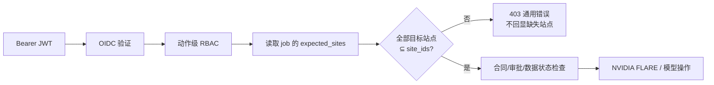

# RareLink 物理控制面站点资源级授权

**状态：** P1 Increment Implemented  
**范围：** OIDC `site_ids` claim 对物理站点、合同和联邦作业操作的资源级约束  
**实现：** `require_site_scope`、`require_physical_site_scope`、`require_physical_job_scope`  
**定位：** 全目标站点子集授权；尚未覆盖公开列表、审计事件过滤和跨组织治理

> 动作级 RBAC 回答“主体能否执行某类操作”，站点 scope 回答“主体能否对这些具体医院站点执行该操作”。两项必须同时满足。站点 scope 是软件授权边界，不替代医院网络隔离、NVIDIA FLARE 证书身份、数据使用协议或研究审批。

## 1. 授权规则

OIDC 验证成功后，`site_ids` claim 被转换为 `PhysicalPrincipal.site_ids`。对具有目标站点的受保护操作，系统要求：

```text
all target_site_ids ⊆ principal.site_ids
```

规则具有以下语义：

- 必须覆盖操作涉及的**全部**站点，而不是任意一个站点；
- 空目标集合、非字符串站点或无效内部作业 scope 失败关闭；
- `site_ids` 不支持 `*`、前缀、正则、组织别名或隐式全局权限；
- 多角色只合并动作权限，不扩大 `site_ids`；
- 动作权限满足但站点不完整时返回 403；
- 错误只说明“未获全部目标站点授权”，不回显缺失站点名称；
- `physical` 模式不能通过 legacy token 绕过，因为该模式强制 OIDC。

示例：

| Principal `site_ids` | 操作目标 | 结果 |
| --- | --- | --- |
| A、B、C | A | 允许，前提是动作权限也满足 |
| A、B、C | A、C | 允许 |
| A、B | A、B、C | 403 |
| 空 | A | 403 |
| A、B、C、D | A、B、C | 允许；多余 scope 不参与合同 |

## 2. 为什么使用“全部目标站点”

三站联邦作业是一个不可拆分的安全与科研合同。批准、提交、停止或恢复其中任一作业，会影响三家参与方和全局模型。若只要求主体拥有一个站点，就可能由医院 A 的管理员单方面控制涉及 B、C 的合同。

因此，当前 contract v1 固定三个站点时，任何作业级操作都要求 OIDC 主体的 `site_ids` 同时包含这三个 Site ID。这是一种保守的协调方授权模型；未来如要支持院内管理员只确认本站局部动作，应设计独立的多方工作流，不能放宽当前子集检查。

## 3. API 映射

| 操作 | 动作权限 | 目标站点来源 | scope 检查位置 |
| --- | --- | --- | --- |
| `POST /api/physical/sites` | `physical.site.register` | 请求的 `site_id` | 写入站点前 |
| `POST /api/physical/jobs` | `physical.contract.create` | 请求的 `expected_sites` | 读取/锁定三站合同前 |
| `POST /api/physical/jobs/{id}:approve` | `physical.contract.approve` | job 的 `expected_sites_json` | 记录第二审批前 |
| `POST .../{id}:submit` | `physical.job.submit` | job 的三站 | 合同/数据复核和 NVFLARE submit 前 |
| `POST .../{id}:sync` | `physical.job.sync` | job 的三站 | 构建 Controller 和 NVFLARE status 前 |
| `POST .../{id}:abort` | `physical.job.abort` | job 的三站 | NVFLARE abort 前 |
| `POST .../{id}:retry` | `physical.job.retry_resume` | job 的三站 | 合同复核和 NVFLARE retry 前 |
| `POST .../{id}:resume` | `physical.job.retry_resume` | job 的三站 | 合同复核和 NVFLARE resume 前 |
| `POST .../{id}:verify-model` | `physical.model.verify` | job 的三站 | 读取/核验协调端模型前 |

### 3.1 检查顺序

典型作业级请求：



站点 scope 必须在 NVFLARE CLI/Adapter、Admin Kit 使用、模型文件访问和任何有副作用控制动作之前完成。授权失败不创建外部 Job、不改变 FLARE 状态，也不把缺失 Site ID 写入响应。

### 3.2 Job scope 来源

作业级操作不接受客户端重新声明站点，而是从已持久化的 `expected_sites_json` 读取目标：

- 防止请求者用更小站点集合规避授权；
- 与 contract v1 的排序三站和 3-of-3 quorum 对齐；
- JSON 不是 list 或为空时返回内部状态冲突，而不是跳过检查。

## 4. OIDC claim 约束

`site_ids` 默认 claim 名可通过 `RARELINK_OIDC_SITES_CLAIM` 配置。OIDC Adapter 已在构造 Principal 前校验：

- 值是字符串或字符串数组；
- 数组可以为空，但空集合不能通过任何目标站点操作；
- 元素唯一、无首尾空格、长度受限；
- Site ID 匹配 `^[a-z][a-z0-9-]{2,62}$`；
- raw claim 不持久化，Principal 只保留规范化 frozenset。

scope 的来源必须是受信 IdP 签名 claim。请求 body、query、header 中自报的组织或站点范围不能扩大 Principal。

## 5. 与双人审批的组合

物理合同的两个主体均需覆盖合同中的全部三站：

1. 提议人：拥有 `contract.create` 且 `expected_sites ⊆ proposer.site_ids`；
2. 第二审批人：拥有 `contract.approve`、`sub` 不同，且同一三站集合是其 scope 子集；
3. 提交/重试/恢复者：拥有对应动作权限，且仍需覆盖同一三站。

所以合同双人审批不会将提议人的站点范围“转授”给审批人或执行人。每个请求都从当前经过验证的 OIDC Principal 独立授权。

`PhysicalJobApprovalRecord` 当前保存 approver subject、角色和合同摘要，但不保存整个 raw `site_ids` claim；合同本身已锁定目标三站。若未来需要证明审批当时的 scope 快照，应加入最小、签名且受保护的 scope 证明，而不是保存 raw JWT。

## 6. Isolated integration 兼容边界

当且仅当 `RARELINK_PHYSICAL_AUTH_MODE=legacy-token` 时，API Adapter 跳过站点 scope。这条路径只允许在 `isolated-integration` 中运行；`physical` 模式会先拒绝 legacy 身份。

legacy 主体拥有测试用全角色，但没有来自受信 IdP 的真实 `site_ids`：

- 可用于三进程/三容器功能和故障测试；
- 不能证明资源级站点授权；
- 不能作为真实跨院身份或职责分离证据；
- 证据必须标记 `deployment_mode=isolated-integration`；
- 现场部署前必须用真实 OIDC 三站 claims 重跑负面验收。

## 7. 当前读取边界

physical 模式下读取路径执行以下规则：

- `GET /api/physical/sites` 要求 `physical.control_state.read`，仅返回 claim 内站点；
- `GET /api/physical/jobs` 要求相同权限，仅当作业全部参与站点均属于 claim 时返回；
- `GET /api/physical/events` 要求 `physical.audit.read`，只导出授权站点及授权作业事件；
- 审计响应的 `verified` 针对服务端完整链，`chain_event_count` 与 `event_count` 分别表示
  全链事件数和本次 scope 导出数；
- `GET /api/physical/audit-summary` 保持公开最小完整性锚点，只返回事件数、链头摘要、
  算法和更新时间，不返回 actor、resource 或 payload。

这已形成站点级读取隔离，但还不是完整多租户模型：organization 与 study membership
尚未绑定资源，列表尚未分页，协调方全局审计角色也尚未单独建模。

## 8. 错误与信息最小化

scope 不足统一返回：

```text
403 Principal is not authorized for every target physical site
```

响应不包含：

- 缺少的 Site ID；
- Principal 已拥有的 Site ID；
- 作业三站列表；
- OIDC subject、角色、组织或 raw claims；
- token、Admin Kit、路径或 NVFLARE 输出。

这样避免未授权主体通过错误差异枚举研究参与方。内部审计目前也不会保存被拒绝请求的 raw scope；拒绝事件的安全 taxonomy 仍属于审计后续工作。

## 9. 测试与验收

自动测试至少覆盖：

- 单站登记要求该站在 claim 内；
- 三站合同要求三站全部在 claim 内；
- 第二审批人缺一个站点返回 403；
- submit/sync/abort/retry/resume/verify-model 在调用 Controller 前拒绝越界主体；
- 错误响应不包含缺失 Site ID、subject 或 token；
- 多角色不扩大 scope；
- 空/非法目标集合失败关闭；
- legacy isolated 跳过，但 physical 拒绝 legacy；
- 作业目标来自持久化合同，不接受请求覆盖；
- 合同摘要与 scope 的目标集合一致。
- physical 的 site/job list 必须认证并按 scope 过滤；
- audit 明细按 scope 导出，但仍核验完整事件链；

```bash
pytest -q \
  tests/test_physical_rbac.py \
  tests/test_physical_oidc_api.py \
  tests/test_physical_dual_approval_api.py \
  tests/test_physical_api.py
```

当前全量回归基线为 **210 项测试通过**；scope 子集不能替代全仓回归。

现场验收：

1. 为每个角色签发仅含 A、B、C 组合的短期测试 token；
2. 逐端点执行完整/缺失一个站点的正负矩阵；
3. 证明所有越界请求在 NVFLARE runner 前终止；
4. 检查错误、代理日志、trace 和审计不泄露缺失站点；
5. 验证 legacy token 在 physical 模式始终 503；
6. 核对公开 audit summary 不含 actor/resource/payload。

## 10. 当前局限与下一步

| 局限 | 影响 | 生产升级 |
| --- | --- | --- |
| 无分页和查询上限 | 大量站点/作业可能影响响应性能 | 游标分页、上限和确定性排序 |
| 无协调方全局审计角色 | 当前只有站点 scope 审计视图 | 独立联盟审计身份、到期授权和双人审批 |
| 无 organization scope 强制 | claim 中 organization 尚未绑定资源组织 | 组织资源模型和策略组合 |
| 无 study scope | 同站点主体可能操作不同研究 | research membership/role binding |
| 不支持 wildcard | 大型协调方需列出全部站点 | 受治理的协调方 scope 类型，不接受自由 `*` |
| 无跨组织授权治理 | 三院联盟变更缺少委派/撤销模型 | 联盟策略、委派、到期和审计 |
| scope 快照未进入审批记录 | 不能直接证明审批当时 claim 集合 | 最小签名 scope attestation |
| 拒绝事件未完整审计 | 越界尝试的中心证据有限 | 低风险拒绝事件 taxonomy 和 SIEM |

不应通过添加 `*` 或“管理员自动全站”快速解决以上问题；跨组织全局权力必须有明确角色、到期、审批和审计。

## 11. 相关文档

- [物理控制面 OIDC 身份与 RBAC](physical-identity-rbac.md)
- [物理联邦合同锁定与双人审批](physical-dual-approval.md)
- [物理控制面防篡改审计](physical-audit.md)
- [三物理 DGX Spark 联邦部署](physical-deployment.md)
