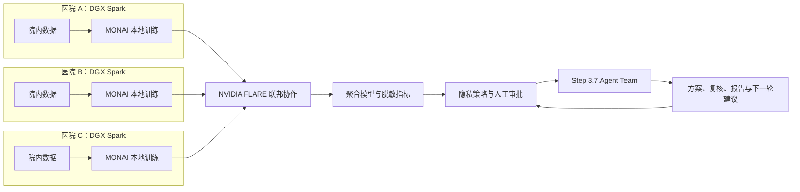

# RareLink 稀联：NVIDIA Inception 项目介绍与企业化路线

> 定位：部署在医院科室内、面向多中心罕见病研究的隐私保护科研操作系统。
>
> 当前边界：科研基础设施，不直接提供临床诊断，不以未经验证的模型结果影响患者诊疗。

## 一、结论先行

RareLink 有机会从黑客松项目发展为成熟企业项目，但不能只停留在“把 NVIDIA FLARE 部署到 DGX Spark 上”。单纯的部署工具容易被原厂示例、集成商或医院信息化项目替代，真正可形成企业价值的产品应当是：

**将研究方案、院内训练、多中心联邦协作、隐私审查、人工审批、失败恢复、指标分析和科研报告，组织成一条可审计、可复现、数据不出院的研究生产线。**

最合适的市场切入点不是“罕见病诊断”，而是：

**罕见病多中心医学影像研究与生物标志物验证。**

这是一个数据稀缺、单院样本不足、跨院共享困难、研究协作成本高的高痛点场景。罕见病是切入口，长期产品可以扩展为肿瘤、遗传病和其他多中心临床研究的隐私计算底座。

当前企业成熟度判断：

| 维度 | 当前判断 | 进入企业市场前需要达到的状态 |
| --- | --- | --- |
| 技术可行性 | 较高，已有可运行原型 | 在真实 DGX Spark 多节点环境完成稳定性与性能验证 |
| NVIDIA 技术契合度 | 很高 | 形成 FLARE、MONAI、DGX Spark 的可量化联合价值 |
| 产品差异化 | 中等偏上 | 从“联邦训练界面”升级为“协议到证据”的科研工作流 |
| 商业验证 | 尚未完成 | 获得 3 家设计合作方、2 份意向书和至少 1 个付费试点 |
| 安全与合规 | 原型阶段 | 完成威胁建模、权限体系、密钥体系、审计和试点合规材料 |
| 临床价值证据 | 尚未建立 | 使用公开或正式授权数据完成可复现实验，不作越界临床声明 |

**判断：值得继续，但比赛结束后首先要验证客户和真实工作流，而不是继续无限增加 Agent 数量。**

---

## 二、一句话介绍

**RareLink 将每台 NVIDIA DGX Spark 变成部署在医院科室内的可信科研节点，让多家医院在原始数据不离开院内的前提下，共同训练和验证罕见病 AI 模型，并由 Step 3.7 Agent Team 协助完成研究方案设计、隐私审查、实验分析和科研报告生成。**

## 三、30 秒口头介绍

罕见病研究面临一个结构性矛盾：单家医院样本太少，而患者影像和临床数据又不能被简单汇总。RareLink 将 DGX Spark 部署为医院科室级科研终端，利用 NVIDIA FLARE 组织多中心联邦训练，利用 MONAI 完成医学影像建模，原始数据始终保留在各医院内部。Step 3.7 驱动的 Agent Team 不接触患者原始数据，只围绕脱敏后的研究协议、训练指标和审计记录，协助研究者完成方案设计、质量复核与报告撰写。我们的目标不是再做一个联邦学习 Demo，而是建立一套从研究协议到可信证据的多中心科研操作系统。

## 四、90 秒负责人介绍

RareLink 解决的是罕见病科研中“数据不能流动，但知识必须协作”的问题。

许多罕见病在单一医院只有少量病例，难以形成具备泛化能力的模型；如果把多家医院的数据集中到一个云端，又会面临伦理审批、数据安全、跨机构协议和患者隐私等现实障碍。RareLink 因此采用“模型流动、数据留院”的技术路线：每个参与科室配置一台 DGX Spark，负责本地数据处理、MONAI 训练与评估；NVIDIA FLARE 负责多机构之间的参数协作、任务编排和安全通信；Step 3.7 Agent Team 负责研究方案、统计审阅、隐私检查和报告生成，但只能读取经过策略引擎批准的脱敏信息与聚合指标。

我们的产品差异不在于重新发明联邦学习算法，而在于把医院真正需要的治理能力补齐：人工审批、研究协议版本、数据使用边界、模型与指标血缘、最弱站点表现、任务失败恢复和全流程审计。研究负责人最终得到的不是一次训练结果，而是一份能够解释“谁在何时、以什么协议、使用哪些站点、产生哪个模型和哪些证据”的可复现研究档案。

当前我们已完成三站点合成数据、MONAI 3D 模型、NVIDIA FLARE FedAvg/FedProx、后台训练任务控制、审计策略和五角色 Agent Team 的端到端原型。下一步将在真实 DGX Spark 节点上验证 ARM64 环境、统一内存利用、多任务调度、故障恢复和多节点通信，并寻找医院科研团队作为设计合作方。

我们希望通过 NVIDIA Inception 获得 FLARE 生产安全架构、MONAI 与 DGX Spark 优化方面的技术指导，以及医疗生态、试点伙伴和商业化资源连接，把 RareLink 从比赛原型推进为可交付的医院科研产品。

---

## 五、为什么必须是 NVIDIA，而不是普通服务器加一个网页

### 1. NVIDIA FLARE 是跨机构协作的核心

[NVIDIA FLARE](https://developer.nvidia.com/flare) 是面向多方分布式协作的开源联邦学习 SDK，允许各站点保留本地数据并交换模型更新。RareLink 直接使用 FLARE 的联邦任务与聚合能力，不重复开发已有基础设施，把研发资源投入医院工作流、研究治理和可审计证据链。

### 2. MONAI 提供医学影像工程基础

RareLink 使用 MONAI 构建医学影像的数据处理、3D 模型训练和评估流程，避免自行实现医学影像领域已有的成熟组件。产品竞争力来自流程整合与可信交付，而不是重复造训练框架。

### 3. DGX Spark 的价值不是“大带宽视频处理”

RareLink 不把 DGX Spark 描述为视频吞吐设备。它在本项目中的关键作用是：

- 医院科室内的本地可信算力，敏感数据无需上传公共云；
- 128GB 一致性统一内存，适合本地运行较大的模型、3D 医学影像任务及多个受控服务；
- NVIDIA 全栈软件环境，降低从模型实验到本地部署的环境差异；
- 小型设备形态便于把算力放到数据产生的位置；
- 在联邦学习中，每个 Spark 是独立参与方，而不是用一台中央服务器假装多家医院。

NVIDIA 官方将 DGX Spark 定位为基于 Grace Blackwell 的桌面 AI 系统，提供 128GB 一致性统一内存及完整 NVIDIA AI 软件栈。RareLink 应通过真实测试证明这些能力怎样改善医学研究任务，而不是只罗列硬件参数。[DGX Spark 官方产品信息](https://www.nvidia.com/en-eu/products/workstations/dgx-spark/)

### 4. Step 3.7 的作用是科研协作，不是接触患者数据

Step 3.7 Agent Team 处理的是研究问题、脱敏协议、聚合指标、失败日志和报告草稿。策略引擎应阻止患者标识符、小样本敏感统计和未经批准的原始内容发送给外部模型服务。

这种分工使系统具备清晰边界：

---

## 六、RareLink 不是“FLARE 管理界面”

如果项目只展示三个节点训练和一张指标曲线，评委和客户会认为它只是已有框架的部署包装。产品必须形成以下差异：

1. **研究协议即代码**：训练目标、纳入排除标准、站点、指标、隐私阈值和停止条件形成版本化协议。
2. **人工责任门**：加入站点、启动训练、释放统计结果和生成最终报告均需授权人员审批。
3. **证据血缘**：任何结论都能追溯到协议版本、数据摘要、代码版本、模型哈希、参与站点和运行日志。
4. **最弱站点优先**：不仅展示平均 Dice，还关注最差站点、站点间差异和异常站点，避免总体指标掩盖偏差。
5. **隐私策略执行**：对标识符、小群体统计、外发内容和 Agent 工具权限进行机器可执行限制。
6. **可恢复的科研任务**：支持中断恢复、任务重试、日志留存和资源串行保护，不把一次演示成功等同于可运营性。
7. **Agent 闭环**：Agent 只能提出下一轮实验和报告草稿，关键操作由人批准；每项建议必须引用结构化证据。

长期护城河不是某一个基础模型，而是医院研究流程模板、联邦站点运营能力、数据适配器、合规证据和跨中心合作网络。

---

## 七、给 NVIDIA Inception 负责人的书面介绍

### 邮件主题

**RareLink：基于 DGX Spark、NVIDIA FLARE 与 MONAI 的罕见病多中心科研操作系统**

### 邮件正文

您好，我们正在开发 RareLink（稀联），一个部署在医院科室内、面向罕见病多中心研究的隐私保护科研操作系统。

罕见病研究长期面临样本分散与数据难以跨院流通的矛盾。RareLink 将每台 DGX Spark 作为一个院内可信科研节点：患者原始数据保留在医院内部，MONAI 在本地完成医学影像训练与评估，NVIDIA FLARE 在多个机构之间组织联邦协作。Step 3.7 驱动的多智能体团队只处理经过策略审查的研究协议、聚合指标和审计信息，协助研究者完成实验设计、统计复核、隐私审查和报告撰写。

RareLink 的目标不是包装一个联邦学习 Demo，而是解决联邦研究落地中缺失的“最后一公里”：研究协议版本化、人工审批、隐私策略、任务恢复、模型与证据血缘、最弱站点分析和全流程审计。系统最终交付的是一条从研究问题到可信科研证据的可复现工作流。

目前，我们已经完成三站点端到端原型，打通 MONAI 3D 模型、NVIDIA FLARE FedAvg/FedProx、后台训练控制、隐私审计和五角色 Agent Team。下一阶段计划在真实 DGX Spark 环境完成多节点性能与稳定性验证，并与医院科研团队共创首个罕见病影像研究试点。

我们希望申请加入 NVIDIA Inception，并重点寻求以下支持：

- NVIDIA FLARE 在生产环境中的安全部署和多机构运维架构指导；
- MONAI、Grace Blackwell 与 DGX Spark 统一内存的性能优化建议；
- 医疗行业生态伙伴和医院科研试点连接；
- 从技术原型走向企业产品的市场、投资与联合展示机会。

RareLink 的长期愿景是成为分布式临床研究的“协议到证据”操作系统，让医院在不集中原始数据的情况下，共同生产可信、可追溯的医学 AI 证据。

期待有机会进行一次产品演示和技术交流。

### 申请表短介绍

RareLink 是面向医院多中心研究的隐私保护科研操作系统。每家医院使用 NVIDIA DGX Spark 作为本地科研节点，以 MONAI 完成医学影像训练与评估，并通过 NVIDIA FLARE 在原始数据不离院的前提下开展联邦学习。Step 3.7 Agent Team 仅处理脱敏协议、聚合指标和审计信息，协助完成实验设计、隐私复核和科研报告。RareLink 以罕见病影像研究为切入口，重点解决联邦项目中的研究协议、人工审批、任务恢复、模型血缘、站点偏差分析及全流程审计问题，目标是建立从研究问题到可信证据的分布式临床科研操作系统。

---

## 八、商业化设计

### 第一批客户

| 角色 | 真实需求 | RareLink 提供的价值 |
| --- | --- | --- |
| 三甲医院临床研究中心 | 发起多中心研究但难以集中数据 | 快速建立受控的跨院训练与验证流程 |
| 罕见病/影像科 PI | 单院样本少、合作沟通成本高 | 统一协议、实验和证据输出 |
| 药企转化医学与生物标志物团队 | 需要跨中心验证候选标志物 | 可审计的分布式验证基础设施 |
| CRO 与疾病联盟 | 多站点交付和合规协调复杂 | 标准化站点节点与项目控制台 |
| 医院数据与隐私负责人 | 担心数据外发、权限失控 | 数据留院、审批、策略与审计记录 |

### 推荐商业模式

1. **站点软件订阅**：按医院节点收取年度软件许可和维护费。
2. **研究联盟许可**：按多中心研究项目或联盟收取协作控制台费用。
3. **企业支持服务**：提供部署验证、安全加固、版本升级和 SLA。
4. **行业模板**：为特定病种提供经过验证的协议、模型流程和指标模板。

不建议把公司做成 DGX Spark 硬件经销商，也不建议早期依赖大量一次性定制开发。硬件是承载平台，产品收入应主要来自可复用软件和持续服务。

### 首个可销售产品

首版企业产品应聚焦一个明确任务：

> **面向 2—5 家医院的多中心回顾性医学影像分割或生物标志物验证工作台。**

其标准交付物包括：站点部署包、研究协议、权限与审批流、联邦训练任务、站点指标、聚合模型、审计档案和可导出的研究报告。不要在首版同时覆盖全部病种、全部数据模态和临床诊断。

---

## 九、从比赛项目到成熟企业的路线

### 阶段 1：比赛交付与硬件验证（0—30 天）

- 在真实 DGX Spark 上完成 ARM64/CUDA/容器部署验证；
- 完成至少两个独立 Spark 节点的真实联邦通信；若资源仅有单节点，必须明确标注为模拟；
- 测量显存/统一内存、训练时长、并发限制、失败恢复和网络传输量；
- 固化一键部署、演示脚本、架构图、视频和 600 字以上项目说明；
- 轮换已暴露的 API 密钥，仓库只保留 `.env.example`；
- 不以合成数据上的低轮次指标证明医学有效性，只证明系统链路完整。

### 阶段 2：客户发现与设计合作（1—3 个月）

- 访谈不少于 20 位 PI、影像科医生、科研平台主管、数据平台主管和药企研究人员；
- 确认谁拥有预算、谁承担风险、谁每天使用系统；
- 争取 3 家设计合作方和 2 份试点意向书；
- 选择一个病种、一个模态和一个可量化研究终点；
- 使用公开数据或正式授权数据建立可复现基线；
- 完成公司主体、官网、产品演示和融资材料，为 Inception 申请做好准备。

### 阶段 3：受控试点（3—6 个月）

- 在 2—3 个真实组织或隔离环境完成跨节点试点；
- 增加医院身份体系、RBAC、SSO、PKI、密钥轮换和安全制品签名；
- 增加 DICOM/DICOMweb、FHIR 或院内文件网关适配；
- 完成数据使用协议、伦理审批边界、威胁模型和安全测试材料；
- 建立模型注册、版本回滚、软件物料清单、监控告警和备份恢复；
- 用预先定义的成功标准验收，而不是只录制一次顺利运行的视频。

### 阶段 4：企业 MVP（6—12 个月）

- 形成标准化部署和升级机制，减少每家医院的定制工作；
- 获得至少 1—2 个付费试点；
- 对训练完成率、故障恢复时间、站点接入周期和合规审计时间形成量化证据；
- 明确社区版、商业版和病种模板的开源边界；
- 建立客户支持、安全响应、版本生命周期和 SLA；
- 在具备真实试点证据后开展联合市场传播和融资。

---

## 十、企业化必须补齐的能力

### 安全与隐私

- 正式威胁模型：恶意站点、模型投毒、成员推断、日志泄露和凭据泄露；
- 安全聚合、差分隐私或隐私预算是否需要，应由具体研究风险决定，不能用“联邦学习”代替隐私论证；
- 站点证书、双向认证、密钥托管、密钥轮换和最小权限；
- 对 Agent 的输入输出、工具调用和数据外发建立强制策略；
- 审计日志防篡改、保留周期和导出机制。

### 医疗科研适配

- DICOM、DICOMweb、FHIR 和院内数据目录连接；
- 研究队列版本、数据字典和纳入排除规则；
- 伦理审批、数据使用协议和撤回机制的记录；
- 站点间数据分布差异、缺失值和标注质量评估；
- 统计分析计划与模型实验的对应关系。

### 企业运维

- 离线或受限网络安装；
- 镜像签名、依赖锁定、SBOM 和漏洞管理；
- 任务队列、资源配额、健康检查、监控与告警；
- 模型注册、回滚、灾难恢复和长期支持版本；
- 明确的数据责任、产品责任和服务边界。

---

## 十一、建议向 NVIDIA Inception 提出的具体请求

不要只说“希望获得资源支持”。应提出能够被负责人转交给具体团队的请求：

1. 安排一次 NVIDIA FLARE 生产部署与安全架构评审；
2. 获取 DGX Spark 上 MONAI 3D 工作负载的性能优化建议；
3. 评估统一内存、任务并发和站点容器隔离的最佳实践；
4. 连接 1—2 家有多中心研究需求的医疗生态伙伴作为设计合作方；
5. 指导从开发者项目转为企业软件时的 NVIDIA 软件分发与品牌使用规范；
6. 在形成真实试点后，申请投资人曝光、行业活动和联合案例机会。

[NVIDIA Inception](https://www.nvidia.com/en-us/startups/) 是面向 AI 初创企业的免费项目，提供技术培训、软件与硬件优惠、生态合作、市场和投资人连接等支持。官方申请条件包括正式注册的公司、正常运行的网站、至少一名开发者且公司成立未满十年；申请还需要提交 pitch deck。项目不要求公司已有收入，也不收取会员费或要求股权。若尚未成立公司，比赛结束后的第一项组织工作就是确定创始团队与公司主体，而不是急于包装融资故事。

---

## 十二、负责人可能追问的问题

### 为什么医院不直接购买一台服务器？

服务器只能提供算力。RareLink 提供的是跨站点研究协议、联邦协作、隐私策略、人工审批、证据血缘和持续运维。DGX Spark 是经过标准化的站点算力载体，RareLink 才是研究工作流产品。

### 为什么选择罕见病？市场是否太小？

罕见病是高痛点切入口，因为单院数据稀缺与跨院协作需求最突出。产品底层能力并不局限于某一种疾病，验证后可扩展到肿瘤和其他多中心研究。但早期必须聚焦一个病种和任务，避免成为泛化平台故事。

### 联邦学习是否自动满足合规要求？

否。联邦学习减少了集中原始数据的需求，但模型更新、统计结果、日志和身份凭据仍可能带来风险。RareLink 的价值之一正是把联邦训练与权限、审批、审计和研究治理结合起来。

### Agent 为什么必要？

Agent 适合处理跨角色、重复且有证据约束的科研协作，例如把研究目标转成实验计划、检查协议与实际运行是否一致、发现异常站点并生成报告草稿。Agent 不应自主批准数据使用、绕过隐私策略或输出临床结论。

### 当前是否已经能进入医院？

还不能把比赛原型描述为可直接采购的医疗产品。当前系统证明了技术链路，下一步需要真实硬件、多组织试点、安全加固、院内适配和合规验证。

---

## 十三、不要对 NVIDIA、评委或客户这样表述

- 不说“数据绝不会泄露”，而说“通过数据留院、最小化外发、策略控制和审计降低风险”。
- 不说“系统可以诊断罕见病”，而说“支持多中心科研训练与验证”。
- 不说“联邦学习天然合规”，而说“联邦学习是隐私保护架构的一部分”。
- 不说“一台 Spark 模拟三个客户端等于完成多院部署”。
- 不用合成数据的模型精度证明临床有效性。
- 不说 Step 3.7 可以读取所有患者材料；应明确外部模型只处理获批的脱敏内容。
- 不把 NVIDIA SDK 名称堆叠当作产品创新，应展示每个组件解决了什么具体问题。

---

## 十四、下一次拿到 DGX Spark 使用窗口时的验证清单

请提前准备以下信息：

- Spark 可使用的开始时间、结束时间和节点数量；
- SSH 地址、端口和用户名，密码或密钥通过安全渠道提供，不写入仓库；
- 可映射的公网端口与网络互通限制；
- 代码仓库地址及推送权限；
- 是否允许安装 Docker、NVIDIA Container Toolkit 和项目依赖；
- 磁盘剩余空间、系统版本、CUDA/驱动版本；
- 是否有第二台 Spark 可执行真实的多节点 FLARE 验证。

拿到时间窗口后按以下顺序执行：

1. 环境与 GPU 基线检查；
2. 后端、前端和 Step API 冒烟测试；
3. MONAI 单站点 GPU 训练；
4. NVFLARE 双节点或多节点训练；
5. 统一内存、运行时间、网络量和失败恢复测试；
6. 固化日志、截图、指标和演示录像；
7. 将脱敏后的部署说明与基准结果提交代码仓库。

所有已在聊天、截图或临时文件中暴露的 API 密钥和机器密码，都应在公开仓库和比赛提交前完成轮换。

---

## 十五、最终对外定位

### 不推荐

> 一个部署在 DGX Spark 上的罕见病联邦学习平台。

这句话只说明用了什么技术，无法说明不可替代的客户价值。

### 推荐

> **RareLink 是部署在医院科室内的多中心科研操作系统。它以 DGX Spark 为可信本地计算节点，以 NVIDIA FLARE 和 MONAI 连接分散的医学数据，并通过受策略约束的 Step 3.7 Agent Team，把研究协议、联邦训练、人工审批、证据审计和科研报告组织成一条数据不出院、过程可追溯的研究生产线。**

### 长期愿景

> **让医疗数据不必离开产生它的机构，也能共同形成可信医学证据。**

