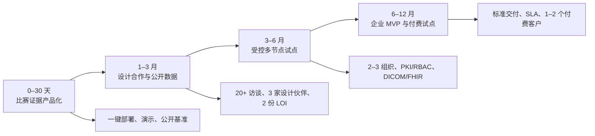

# RareLink 企业化一页路线图

## 定位

**RareLink 是部署在医院科室内的“协议到证据”多中心科研操作系统。** 每个科室以 DGX Spark 作为本地科研节点，MONAI 完成影像训练，NVIDIA FLARE 组织跨机构协作，Step 3.7 Agent 仅处理脱敏协议和聚合指标；原始数据不离院，关键动作可审批、可追溯、可复现。

**不做什么：** 不提供诊断或治疗建议；不把联邦学习等同于合规；不把比赛版单 Spark 模拟说成医院生产部署。

## 当前可证明的工程基础

| 已有证据 | 商业含义 | 仍缺什么 |
| --- | --- | --- |
| DGX Spark GB10 上 MONAI 3D 训练、FLARE 聚合、前后端与审计闭环 | 可在数据所在位置运行受控科研任务 | 2–5 个真实医院节点的长期运行 |
| 五种子 × 五策略 × 三轮，25/25 实验 | 有可复现的策略比较与最弱站点指标 | 授权公开/真实数据上的外部工程验证 |
| 样本级 DP-SGD 与 RDP 会计 | 可讨论隐私—效用权衡，而不只喊口号 | 安全聚合、攻击评测、生产随机源与机构级威胁模型 |
| Spark–Mac mTLS、重连、错误身份拒绝 | 有跨物理设备的身份链路证据 | 医院 WAN、证书轮换、撤销、SSO 与 SLA |
| Agent 输入/输出网关，红队 26/26 | Agent 处于受控科研工作流而非任意聊天入口 | 扩展提示注入、工具越权与人工复核评测 |

## 首个可销售产品

**2–5 家医院的多中心回顾性影像研究工作台。**

标准交付：本地 Spark 部署包、研究协议模板、RBAC/审批流、FLARE 站点接入、MONAI 训练任务、最弱站点分析、模型/指标血缘、审计档案与可导出研究报告。

首个病种只选一个、首个任务只选一个：推荐“儿童脑肿瘤多中心 MRI 分割/生物标志物验证”。罕见病是高痛点切入口，底层能力可随后扩展至肿瘤、遗传病和药企转化研究。

## 12 个月路线

| 阶段 | 成功标准 | 关键决策 |
| --- | --- | --- |
| 0–30 天 | 评审可一键运行并复核证据；公开数据链路可复现 | 不再堆叠新 Agent，优先演示与证据质量 |
| 1–3 月 | 访谈 20+ 位 PI/影像科/数据负责人；3 家设计伙伴、2 份 LOI | 确认预算拥有者、部署责任人与首个付费场景 |
| 3–6 月 | 2–3 个独立站点完成受控试点 | 接入 RBAC、SSO、PKI、证书轮换、DICOM/DICOMweb/FHIR 适配 |
| 6–12 月 | 1–2 个付费试点，形成标准化部署与支持 | 销售软件与持续服务，不做硬件经销或无限定制 |

## 关键护城河与风险

**护城河不是 FLARE 或某个模型。** 它来自病种研究模板、站点接入与运行能力、协议/审批/审计证据、数据适配器，以及跨中心合作网络。

**最大风险不是算法，而是购买与落地。** 医院是否有明确科研预算、谁运营院内节点、真实流程是否需要跨院训练、合规责任如何划分，都需要在设计合作阶段验证。

## 向 NVIDIA Inception 的请求

1. FLARE 生产安全架构与多机构运维评审；
2. DGX Spark 上 MONAI 3D 任务、统一内存与容器隔离优化；
3. 医疗研究生态中 1–2 家设计合作伙伴连接；
4. 软件分发、联合展示与从原型到企业 MVP 的产品化指导。

**一句话结论：** RareLink 值得发展为企业项目，前提是先用真实设计伙伴验证“多中心科研工作流”这一付费痛点，而不是把比赛 Demo 直接包装为临床产品。
