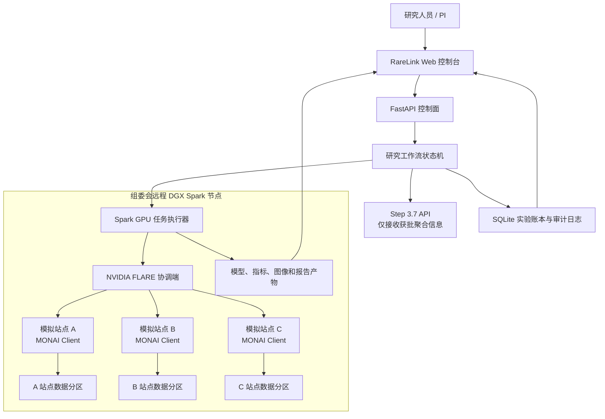

# RareLink 稀联：项目开发规格书

> 文档用途：可直接交给 Codex 作为项目开发、部署和验收依据。  
> 项目定位：罕见病本地研究分析与多中心联邦科研智能体，不用于临床诊断或治疗决策。  
> 推荐赛题名称：**RareLink 稀联——每个科室一台 DGX Spark 的罕见病联邦科研智能体终端**

## 1. 部署问题的直接结论

### 1.1 没有实体机器是否可以开发

可以。组委会提供的远程节点就是本队可使用的 DGX Spark 开发与演示环境，不需要接触实体设备。

开发方式如下：

1. 在个人电脑上完成代码、界面、单元测试和 CPU Mock 流程；
2. 通过 SSH 登录远程 Spark 节点；
3. 在 Spark 节点安装或启动项目运行环境；
4. 把医学影像训练、NVIDIA FLARE 联邦模拟和 GPU 推理放在 Spark 上运行；
5. 通过 SSH 隧道或组委会提供的端口映射访问 Web 界面；
6. 使用 Git 传输代码，数据集通过合规的数据下载地址在节点侧获取，不通过 SSH 上传大文件。

比赛阶段只有一个 Spark 节点，因此采用：

> **一台真实 DGX Spark + 三个逻辑医院站点 + 单机联邦学习模拟。**

演示页面必须标注“3 个模拟站点运行在同一 DGX Spark 上”，不能声称已经在三家真实医院部署。

### 1.2 Spark 上需要部署什么

需要。Spark 是项目的核心运行节点，应部署：

- NVIDIA GPU 容器或 ARM64 Python 运行环境；
- PyTorch、MONAI 和医学影像依赖；
- NVIDIA FLARE 及三站点模拟配置；
- 3D 分割训练、推理和评价任务；
- FastAPI 后端、任务队列和实验账本；
- 前端静态资源或前端服务；
- 本地数据目录、模型目录和审计日志。

不应在本机假装完成 GPU 实验后只把结果复制到 Spark。最终演示至少要有一次可复现的任务确实在 Spark GPU 上运行，并记录 GPU 型号、显存/统一内存、耗时和配置。

### 1.3 Step 3.7 是否需要本地部署

**默认不需要，也不建议。**

使用赛事提供的 StepFun API Plan，通过 OpenAI 兼容接口调用 `step-3.7-flash`。Step 3.7 只承担研究协议生成、任务编排、实验解释、隐私审查和报告写作，不参与像素级训练。

不建议把 Step 3.7 权重部署到同一台 Spark，原因是：

- 大模型会占用大量统一内存；
- 会和 3D MONAI 训练争抢 GPU 与内存；
- 对比赛评分没有明显额外收益；
- API 调用更稳定，也能把 Spark 资源留给本地隐私计算和联邦训练。

发送给 Step 3.7 的内容仅限：公开研究问题、字段定义、经过批准的聚合统计、实验指标和脱敏日志。**禁止发送患者影像、原始病历、精确身份信息和小样本明细。**

## 2. 项目目标

RareLink 将一项罕见病多中心研究转化为可执行、可审批、可追溯的 Agent 工作流：

```text
研究人员提出问题
→ Agent 生成研究协议草案
→ 各站点执行本地数据质控和联邦可行性统计
→ 人工批准实验合同
→ Spark 运行本地基线与联邦训练
→ Agent 比较策略并检查最差站点表现
→ 隐私 Agent 审查输出
→ 生成研究报告、模型卡、站点数据卡和实验账本
```

一句话价值：

> **数据不出科室，模型跨院学习，Agent 自动组织一项可复现的多中心研究。**

### 2.1 比赛 MVP 的具体研究任务

推荐使用“小儿高级别胶质瘤多站点 MRI 肿瘤分割”作为罕见病研究故事，以 3D MRI 分割验证联邦流程。

优先数据顺序：

1. 获得许可后使用公开的 BraTS-PEDs 或 DFCI-BCH-BWH Pediatric HGG 数据；
2. 若数据申请或下载来不及，使用 NVIDIA FLARE 官方 BraTS 联邦示例或公开 BraTS 工程数据完成技术验证；
3. 若完整影像仍不可得，使用少量公开样本加程序生成的合成 NIfTI 完成端到端演示。

任何替代数据都必须在 README、界面和视频中明确标注。不能把成人 BraTS、合成数据或人为切分数据描述为真实罕见病多院验证。

### 2.2 MVP 必须回答的研究问题

在三个非独立同分布的模拟站点中：

- 联邦模型是否优于各站点仅使用本地数据训练的模型；
- FedAvg 与至少一种异质性策略的结果有何差异；
- 平均 Dice 提升是否以牺牲最差站点表现为代价；
- 哪些站点数据差异影响了训练；
- 每次策略变更是否保持相同数据划分、预算和评价协议；
- 向 Step 3.7 和协调端发送了哪些字段，哪些字段被策略阻止。

## 3. 范围与非目标

### 3.1 本届比赛实现范围

- 单台 DGX Spark 上模拟 3 个逻辑站点；
- 一个完整研究项目生命周期；
- 本地数据质控和隐私保护的汇总统计；
- 本地模型、FedAvg 和 FedProx/SCAFFOLD 中至少两类结果比较；
- Step 3.7 驱动的研究 Agent Team；
- 人工审批关卡；
- Web 控制台、实验账本、报告导出；
- 可复现部署脚本和演示视频。

### 3.2 明确不做

- 不提供自动诊断结论；
- 不提供治疗建议或患者风险评分；
- 不接入真实医院生产系统；
- 不宣称通过伦理审批、医疗器械认证或真实多中心临床验证；
- 不宣称联邦学习等于绝对隐私；
- 不在比赛 MVP 中实现完整同态加密系统；
- 不让大模型自由修改测试集、总训练预算或隐私策略。

## 4. 单节点比赛架构



### 4.1 资源职责

| 位置 | 负责内容 | 不负责内容 |
|---|---|---|
| 个人电脑 | 编码、Git、前端开发、CPU 测试、文档 | 最终 GPU 实验 |
| 远程 DGX Spark | MONAI 训练、FLARE 模拟、推理、应用服务、产物存储 | 公开互联网长期生产服务 |
| Step 3.7 API | 协议、编排建议、指标解释、报告生成 | 原始医疗数据处理、模型训练 |
| GitHub/Gitee | 源码、配置模板、脱敏小样例、文档 | 密钥、大型数据集、患者数据、模型缓存 |

### 4.2 将来真实多院扩展

正式环境中，每家医院的一台 Spark 只运行本地 Agent 与 FLARE Client；FLARE Server 部署在独立协调节点。比赛版的站点接口、任务协议和审计模型保持不变，只把三个本地进程替换为三个网络客户端。

## 5. 系统功能

### 5.1 研究项目向导

输入：疾病方向、研究目标、数据模态、主要终点、站点数和计算预算。

输出：

- 研究假设；
- 纳入/排除标准草案；
- 数据字段与标签定义；
- 主要/次要评价指标；
- 允许执行的联邦策略；
- 隐私规则；
- 实验预算；
- 待人工确认事项。

协议必须以结构化 JSON 保存，Step 3.7 输出必须通过 Pydantic Schema 校验后才能进入系统。

### 5.2 联邦可行性统计

每个站点本地计算：

- 样本数量；
- 模态缺失率；
- 标签完整率；
- 图像尺寸、间距和强度分布；
- 年龄段等分桶统计；
- 数据异常和不可用样本数量。

输出策略：

- 小于阈值 `k` 的分组不返回精确计数；
- 仅返回白名单字段；
- 输出前生成 policy decision；
- 原始文件路径、患者 ID 和单病例数据不得离开站点模块。

### 5.3 实验合同

在训练前锁定以下内容：

```yaml
contract_id: contract-demo-001
dataset_version: demo-v1
split_seed: 2026
sites: [site-a, site-b, site-c]
task: 3d_tumor_segmentation
model: segresnet-small
strategies: [local, fedavg, fedprox]
rounds: 5
local_epochs: 1
max_trials: 3
primary_metric: mean_dice
guardrail_metrics: [worst_site_dice, site_dice_std, hd95]
privacy:
  min_group_size: 5
  raw_data_egress: false
  llm_raw_data_access: false
```

合同批准后，Agent 只能在明确的搜索空间内提出实验，不得更改测试划分、主要指标和总预算。

### 5.4 联邦实验

最低实现：

- Site A/B/C 本地模型；
- FedAvg；
- FedProx；
- 相同模型、数据划分和总预算；
- 每轮全局指标与每站点指标；
- 最终模型、配置、日志和哈希值归档。

进阶实现：

- SCAFFOLD 或 FedAdam；
- 留一站点验证；
- 个性化微调；
- 差分隐私对精度的影响；
- 在版本兼容时接入 FLARE Auto-FL，并严格限制搜索预算。

Auto-FL 是加分项而非 MVP 阻塞项。不要为了追逐预发布功能破坏稳定演示。

### 5.5 Agent 研究评审

Agent 根据实验账本生成：

- 哪个策略满足主要指标；
- 最差站点是否退化；
- 数据异质性与结果的可能关系；
- 结果是否具有足够证据；
- 局限性和下一步实验；
- 不允许生成的临床结论。

所有结论必须引用 `experiment_id` 和具体指标，不允许脱离实验数据自由发挥。

### 5.6 产物导出

每个研究项目应能导出：

- `protocol.md` / `protocol.json`；
- `federated_feasibility_report.md`；
- `experiment_ledger.jsonl`；
- `model_card.md`；
- `privacy_report.md`；
- `research_report.md`；
- `reproduce.yaml`；
- 指标图和站点拓扑图。

## 6. Agent Team 设计

Agent Team 使用确定性状态机编排，Step 3.7 负责需要语言理解的节点。不要实现成多个无限对话的聊天机器人。

| Agent | 输入 | 工具 | 输出 | 人工关卡 |
|---|---|---|---|---|
| 研究主任 Agent | 研究问题、公共知识 | Step 3.7、协议 Schema | 研究协议草案 | 必须批准 |
| 站点数据管家 Agent | 本地 NIfTI 和标签 | MONAI、统计脚本、策略引擎 | 本地数据卡、受控统计 | 异常时批准 |
| 联邦实验 Agent | 已批准合同 | FLARE、训练执行器 | 实验任务和结果 | 启动前批准 |
| 统计审稿 Agent | 实验账本 | 统计函数、Step 3.7 | 方法比较和局限性 | 报告前审核 |
| 隐私红队 Agent | 出站数据、日志、报告 | 规则引擎、Step 3.7 | 阻断/放行决定 | 阻断不可绕过 |
| 科研写作 Agent | 获批协议和结果 | Step 3.7、模板 | 报告、模型卡 | 发布前批准 |

### 6.1 Agent 状态机

```text
DRAFT
→ PROTOCOL_REVIEW
→ FEASIBILITY_RUNNING
→ FEASIBILITY_REVIEW
→ CONTRACT_LOCKED
→ TRAINING_RUNNING
→ RESULTS_REVIEW
→ PRIVACY_REVIEW
→ REPORT_READY
→ ARCHIVED
```

失败状态：`BLOCKED_BY_POLICY`、`FAILED_RETRYABLE`、`FAILED_FINAL`。每次状态变更写入审计日志。

### 6.2 Step 3.7 调用规则

- API Base URL、模型名和密钥只从环境变量读取；
- 请求体在发送前执行字段过滤和长度限制；
- 响应要求 JSON Schema；
- 设置超时、指数退避和最大重试次数；
- 保存 prompt 模板版本、响应哈希和 token 用量；
- API 不可用时允许人工模板继续流程；
- 演示缓存必须明确标注为 `cached_demo_response`，不能冒充实时生成。

## 7. 技术栈

| 层 | 推荐技术 | 说明 |
|---|---|---|
| 前端 | React + TypeScript + Vite | 控制台和可视化，构建简单 |
| 医学影像查看 | Niivue 或轻量切片叠加组件 | 优先保证稳定，不因 3D Viewer 阻塞 MVP |
| 后端 | Python 3.11 + FastAPI + Pydantic | API、状态机和任务控制 |
| 数据库 | SQLite | 单节点比赛版足够，保留 Repository 接口 |
| 任务执行 | 后台 Worker + 受控子进程 | MVP 不引入 Redis/Celery 复杂度 |
| 联邦学习 | NVIDIA FLARE 稳定版 | 优先稳定版并在 Spark 上实际验证 |
| 医学 AI | PyTorch + MONAI | 3D 分割、预处理和评价 |
| 模型 | 小型 3D SegResNet/UNet | 保证三站点模拟可在限定时间完成 |
| Agent 模型 | Step 3.7 Flash API | 研究编排和报告，不部署权重 |
| 实验账本 | SQLite + JSONL | 可查询且便于导出复现 |
| 容器 | Docker Compose / NGC ARM64 镜像 | 先验证 GPU 与 ARM64 兼容性再锁版本 |
| 测试 | Pytest + Playwright/Vitest | 后端、策略和关键 UI 流程 |

### 7.1 版本原则

- 不在文档中盲目锁定未经 Spark 验证的 CUDA/容器标签；
- 首次登录节点后记录架构、驱动、CUDA、Docker 和磁盘空间；
- 优先使用当前稳定版 NVIDIA FLARE；若选择 `2.7.2`，先验证所需 API；
- 新的 `SimEnv` 可用时优先使用；否则封装兼容适配层，不让业务代码依赖 CLI；
- Auto-FL 若依赖 RC 或主分支，放在独立 feature flag 下；
- 将最终通过测试的版本写入 `requirements.lock` 或容器 digest。

官方参考： [NVIDIA FLARE](https://nvidia.github.io/NVFlare/)、[FL Simulator](https://nvflare.readthedocs.io/en/main/user_guide/nvflare_cli/fl_simulator.html)、[FLARE 安全](https://nvidia.github.io/NVFlare/security/)、[MONAI](https://github.com/Project-MONAI/MONAI)、[DGX Spark NGC](https://docs.nvidia.com/dgx/dgx-spark/ngc.html)、[Step 3.7](https://github.com/stepfun-ai/Step-3.7-Flash)。

## 8. 代码仓库结构

```text
rarelink/
├── README.md
├── LICENSE
├── SECURITY.md
├── .env.example
├── docker-compose.yml
├── Makefile
├── pyproject.toml
├── apps/
│   ├── api/                    # FastAPI 路由与依赖
│   ├── web/                    # React 前端
│   └── worker/                 # 后台任务执行器
├── rarelink/
│   ├── agents/                 # Agent、prompt 和结构化输出
│   ├── workflow/               # 状态机与审批关卡
│   ├── policy/                 # 数据出站、k 抑制和 LLM 过滤
│   ├── federation/             # FLARE 适配器和 recipe
│   ├── imaging/                # MONAI 数据、模型和指标
│   ├── ledger/                 # 实验账本与审计日志
│   ├── reports/                # Markdown 报告模板
│   └── common/                 # 配置、异常和日志
├── configs/
│   ├── studies/
│   ├── flare/
│   ├── policies/
│   └── models/
├── data/
│   ├── README.md               # 只写获取方式，不提交真实数据
│   ├── synthetic/
│   └── manifests/
├── scripts/
│   ├── inspect_spark.sh
│   ├── bootstrap_spark.sh
│   ├── prepare_demo_data.py
│   ├── smoke_gpu.py
│   ├── run_fl_demo.py
│   └── export_demo_bundle.py
├── tests/
│   ├── unit/
│   ├── integration/
│   ├── policy/
│   └── e2e/
├── docs/
│   ├── architecture.md
│   ├── deployment.md
│   ├── experiment.md
│   ├── privacy.md
│   ├── demo-script.md
│   └── ten-day-log.md
└── artifacts/                  # Git ignore；运行时产物
```

## 9. 核心数据结构

### 9.1 ResearchProtocol

```json
{
  "protocol_id": "rp-001",
  "title": "Pediatric HGG multi-site segmentation feasibility study",
  "research_question": "...",
  "modalities": ["T1", "T1CE", "T2", "FLAIR"],
  "inclusion_criteria": ["..."],
  "primary_endpoint": "mean_dice",
  "guardrails": ["worst_site_dice", "site_dice_std"],
  "status": "PROTOCOL_REVIEW",
  "version": 1
}
```

### 9.2 ExperimentRecord

```json
{
  "experiment_id": "exp-003",
  "contract_id": "contract-demo-001",
  "strategy": "fedprox",
  "hypothesis": "FedProx may reduce site drift",
  "change": {"mu": 0.01},
  "fixed_budget": {"rounds": 5, "local_epochs": 1},
  "metrics": {
    "mean_dice": 0.0,
    "worst_site_dice": 0.0,
    "site_dice_std": 0.0,
    "hd95": 0.0
  },
  "artifact_hashes": {},
  "decision": "pending_review"
}
```

### 9.3 PolicyDecision

```json
{
  "decision_id": "pd-014",
  "action": "send_aggregate_to_llm",
  "result": "blocked",
  "rule": "small_group_suppression",
  "blocked_fields": ["age_bucket_0_5_count"],
  "timestamp": "ISO-8601"
}
```

## 10. API 设计

| 方法 | 路径 | 用途 |
|---|---|---|
| `POST` | `/api/studies` | 创建研究项目 |
| `GET` | `/api/studies/{id}` | 查询项目和当前状态 |
| `POST` | `/api/studies/{id}/protocol:generate` | 调用 Step 生成协议草案 |
| `POST` | `/api/studies/{id}/approve` | 执行人工审批 |
| `POST` | `/api/studies/{id}/feasibility:run` | 运行三站点可行性统计 |
| `POST` | `/api/studies/{id}/contract:lock` | 锁定实验合同 |
| `POST` | `/api/studies/{id}/experiments` | 创建允许范围内的实验 |
| `POST` | `/api/experiments/{id}:run` | 在 Spark 上启动任务 |
| `GET` | `/api/experiments/{id}/events` | SSE 返回进度和日志摘要 |
| `GET` | `/api/experiments/{id}/metrics` | 查询全局和站点指标 |
| `POST` | `/api/studies/{id}/review:generate` | 生成统计与隐私评审 |
| `POST` | `/api/studies/{id}/report:generate` | 生成报告 |
| `GET` | `/api/studies/{id}/export` | 导出研究包 |
| `GET` | `/api/system/capabilities` | 显示 Spark、GPU、FLARE、MONAI 状态 |

所有改变状态的 API 必须：验证当前状态、检查权限、写入审计日志、返回可追踪的任务 ID。

## 11. 前端页面

### 11.1 首页/总览

- 一句话价值；
- 当前研究状态；
- Spark GPU 和运行环境状态；
- 三个模拟站点拓扑；
- “单节点模拟，非真实医院部署”标识。

### 11.2 研究协议页

- 自然语言研究问题；
- Agent 生成的结构化协议；
- 版本差异；
- 批准、退回按钮；
- Step 3.7 可见字段列表。

### 11.3 站点数据页

- 三个站点的样本量、模态缺失、图像分布；
- 非 IID 差异图；
- 被隐私策略抑制的字段；
- 本地数据未出站说明。

### 11.4 联邦实验页

- 本地、FedAvg、FedProx 实验卡；
- 训练轮次进度；
- 平均 Dice、最差站点 Dice、站点方差和 HD95；
- 固定预算与变更字段；
- Agent 下一实验建议与人工批准。

### 11.5 模型对比页

- MRI 切片和分割叠加；
- Ground truth、本地模型、联邦模型切换；
- 每站点效果；
- “研究用途，非诊断”水印。

### 11.6 审计与报告页

- 实验账本时间线；
- LLM 调用字段摘要；
- 隐私策略放行/阻断记录；
- 一键导出研究报告、模型卡和复现配置。

## 12. 隐私与安全设计

### 12.1 必须实现的比赛级控制

- 环境变量管理密钥；
- `.env`、数据和模型目录加入 `.gitignore`；
- LLM 请求前字段白名单；
- 小样本计数抑制；
- 站点数据目录隔离；
- 输入路径防穿越；
- 后台任务只允许执行预注册命令，禁止任意 shell；
- 审批和状态转换审计；
- 报告中的临床措辞检查；
- Web 仅通过 SSH 隧道或受控映射访问，不公开 FLARE 内部端口。

### 12.2 演示用隐私红队案例

在 Demo 中故意构造一个站点只有 2 例的年龄分组：

1. 数据管家产生精确统计；
2. 出站策略发现计数低于 `k=5`；
3. 系统将字段替换为 `<5` 或直接移除；
4. 隐私 Agent 阻止原始字段进入 Step 请求；
5. 审计页显示阻断规则和事件编号。

这个案例比只在 PPT 中宣称“数据不出域”更有说服力。

### 12.3 真实医疗部署仍需完成

比赛版不能替代真实环境所需的伦理审批、数据使用协议、网络安全评估、PKI、访问控制、密钥轮换、漏洞管理、备份恢复、模型验证和医疗器械合规。

## 13. 环境变量

`.env.example` 只包含占位符：

```dotenv
APP_ENV=development
DATABASE_URL=sqlite:///./artifacts/rarelink.db
ARTIFACT_ROOT=./artifacts
DATA_ROOT=./data/runtime

STEP_API_BASE=https://api.stepfun.com/v1
STEP_API_KEY=replace_me
STEP_MODEL=step-3.7-flash
STEP_TIMEOUT_SECONDS=60

RARELINK_MIN_GROUP_SIZE=5
RARELINK_ALLOW_LLM=true
RARELINK_DEMO_CACHE=false
RARELINK_FL_MODE=simulator
CUDA_VISIBLE_DEVICES=0
```

任何主机地址、用户名、密码、API Key、Plan 兑换码均不得提交到仓库或写入文档。已经通过聊天或群聊暴露的密码应尽快更换。

## 14. Spark 部署流程

以下是 Codex 应实现的部署逻辑，不应在未检查节点前直接照抄固定镜像版本。

### 14.1 第一次登录只做环境审计

运行并保存：

```bash
uname -a
uname -m
nvidia-smi
docker version
docker info
df -h
free -h
python3 --version
```

验收：

- 确认为 ARM64/aarch64；
- NVIDIA 驱动和 GPU 可见；
- Docker 可访问 GPU；
- 磁盘足够存放容器、数据和产物；
- 记录到 `docs/runtime-inventory.md`，不包含敏感信息。

### 14.2 选择运行方式

优先方案：使用 NVIDIA 提供并验证支持 Spark ARM64 的 PyTorch/NGC 容器，在其上安装项目依赖。

兼容方案：若 NGC 镜像与依赖冲突，使用节点原生 CUDA/PyTorch Python 环境，并用虚拟环境隔离。

容器 GPU 冒烟测试：

```bash
python -c "import torch; print(torch.cuda.is_available()); print(torch.cuda.get_device_name(0))"
```

MONAI/FLARE 冒烟测试：

```bash
python -c "import monai, nvflare; print(monai.__version__, nvflare.__version__)"
```

### 14.3 代码与数据

- 代码通过 Git clone/pull 获取；
- 小型配置和合成数据可随仓库提供；
- 大型公开数据在 Spark 节点直接下载到 `DATA_ROOT`；
- 校验下载文件哈希；
- 不通过 SSH/SCP 上传大型数据；
- 不把数据提交到 Git。

### 14.4 启动服务

Codex 应提供统一入口：

```bash
make bootstrap
make smoke
make demo-data
make run-api
make run-web
make run-fl-demo
make export-demo
```

如使用 Compose，应提供：

```bash
docker compose up -d api web worker
docker compose logs -f worker
```

Web 服务只绑定一个组委会已映射的应用端口。数据库、FLARE 协调端和调试端口不应暴露到公网。

### 14.5 内存策略

Spark 的优势是 128GB 统一内存和本地 AI 全栈能力，不是无限带宽。项目应：

- 三个模拟客户端优先顺序运行本地训练，避免同时占满统一内存；
- 使用裁剪后的 3D patch、小 batch 和混合精度；
- Step 3.7 走 API，避免大模型占用本地内存；
- 记录峰值内存；
- 任务开始前检查可用内存；
- 内存压力过高时拒绝启动新任务，而不是让节点失联。

## 15. 开发阶段与验收标准

### Phase 0：仓库与节点审计（P0）

任务：

- 初始化 monorepo；
- 完成 `.env.example`、Makefile、日志和配置系统；
- 编写 Spark 环境审计脚本；
- 建立 CI 的 CPU 测试；
- 创建安全说明和数据目录说明。

验收：新开发者按 README 可在 15 分钟内启动 Mock 后端和前端；仓库扫描不到密钥。

### Phase 1：无 GPU 的端到端骨架（P0）

任务：

- 实现研究项目、状态机、审批、实验账本；
- 实现 Step 3.7 客户端和 Mock 客户端；
- 实现结构化协议 Schema；
- 实现隐私字段过滤与小样本抑制；
- 完成主要前端页面骨架。

验收：在个人电脑上可从“创建研究”走到“生成 Mock 报告”，所有状态和审计事件可查询。

### Phase 2：MONAI 单站点基线（P0）

任务：

- 建立合成 NIfTI 数据生成器；
- 实现 Dataset Manifest；
- 实现轻量 3D SegResNet/UNet 训练；
- 输出 Dice、HD95、推理叠加图；
- 在 Spark GPU 完成冒烟训练。

验收：同一配置可重复运行；产物包含配置、日志、指标和哈希；GPU 运行证据展示在能力页。

### Phase 3：三站点 FLARE 模拟（P0）

任务：

- 将数据确定性划分为三个非 IID 站点；
- 接入 NVIDIA FLARE simulator/SimEnv；
- 运行 FedAvg；
- 运行 FedProx；
- 汇总每站点和全局指标；
- 与本地模型进行公平比较。

验收：一条命令可重建三站点实验；前端实时显示轮次；失败任务可诊断；账本中实验预算一致。

### Phase 4：Agentic Research 闭环（P0）

任务：

- Step 3.7 生成协议；
- Agent 根据可行性统计提出可解释的实验建议；
- 人工审批后才启动训练；
- 统计审稿和隐私红队输出结构化报告；
- 报告中的数字可回链到实验记录。

验收：任意报告结论都能定位到实验 ID；原始患者级字段进入 Step 请求时被测试用例阻断。

### Phase 5：展示与优化（P1）

任务：

- 完成拓扑、指标、切片叠加和账本时间线；
- 添加 Spark 资源监控；
- 优化首屏和演示路径；
- 准备稳定的短训练配置和已完成实验包；
- 生成报告和模型卡。

验收：5 分钟 Demo 不需要命令行救场；实时动作和预计算结果边界清楚；断网或 Step API 暂时不可用时仍能解释并继续非 LLM 页面展示。

### Phase 6：加分项（P2）

- Auto-FL 有界策略搜索；
- 个性化联邦微调；
- 差分隐私消融；
- 留一站点验证；
- NVFLARE POC 模式的两个独立客户端演示；
- TensorRT 或 `torch.compile` 推理优化。

只有 P0 全部通过后再做 P2。

## 16. 测试计划

### 16.1 单元测试

- 状态机非法跳转被拒绝；
- 实验合同锁定后不可修改关键字段；
- 小样本计数被抑制；
- 非白名单字段不会进入 Step 请求；
- Step 结构化输出不合法时不落库；
- 指标汇总和最差站点计算正确；
- 命令执行器拒绝未注册命令。

### 16.2 集成测试

- Mock Step → 协议 → 审批 → Mock 实验 → 报告；
- 合成 NIfTI → MONAI 训练 → 指标 → 叠加图；
- 三站点 FLARE 短任务；
- Worker 中断后的任务状态恢复；
- 导出包可在空目录中读取和复核。

### 16.3 Spark 验收测试

- GPU 可见；
- MONAI CUDA 推理成功；
- FLARE 三客户端短任务成功；
- 训练期间 Web 仍可访问；
- 峰值内存不导致节点失联；
- 重启服务后实验账本仍存在。

### 16.4 安全测试

- `.env` 不进入 Git；
- API 日志不输出密钥；
- 路径穿越失败；
- 超小分组无法通过出站策略；
- 伪造状态跳转失败；
- Step 请求快照中不含患者级字段。

## 17. 演示脚本

建议视频时长 4–6 分钟。

1. **问题（20 秒）**：罕见病单院样本少，但医疗数据不能随意集中。
2. **形态（20 秒）**：每个科室一台 Spark；比赛中用一台 Spark 模拟三个站点。
3. **提出研究问题（35 秒）**：输入小儿高级别胶质瘤 MRI 分割研究问题，Step 3.7 生成结构化协议。
4. **隐私可行性（40 秒）**：三个站点只返回统计；展示一个 `<5` 小分组被红队阻断。
5. **人工审批（20 秒）**：锁定数据划分、训练预算、策略和指标。
6. **Spark 实时运行（45 秒）**：启动一次短联邦轮次，显示 GPU、三个客户端和日志。
7. **实验结果（50 秒）**：比较本地、FedAvg、FedProx，重点展示平均和最差站点，而非只挑最高分。
8. **Agent 评审（40 秒）**：生成有证据引用的结论、局限性和下一步实验。
9. **科研资产（30 秒）**：导出协议、账本、隐私报告、模型卡和复现配置。
10. **收束（20 秒）**：不是诊断工具，而是一套让敏感数据留在科室、让多中心研究可执行的智能体科研基础设施。

不要把数分钟训练剪辑成“完整训练只需几秒”。视频可展示短轮次实时运行，再切换到预先完成且带时间戳的完整实验结果。

## 18. 对照评分标准

| 评分项 | 项目证据 |
|---|---|
| 实用性、落地与创新 25% | 解决罕见病多中心数据协作；Agent 创建并审查可复现研究，不是简单部署 FLARE |
| 智能体融合与优化 25% | 六类 Agent、确定性工作流、受约束实验、站点异质性比较、隐私红队 |
| 完整性 20% | 前后端、训练、联邦、审批、账本、报告、测试和一键部署 |
| 平台适配 15% | Spark 承载本地 3D 医学 AI 和联邦节点；FLARE、MONAI、CUDA；Step 3.7 负责编排 |
| 演示效果 10% | 研究问题到报告完整闭环；实时 GPU 联邦轮次；隐私策略可视化 |
| 赛事征文 5% | 记录十日开发、技术选择、失败实验、Spark 资源优化和安全边界 |

## 19. 风险与降级策略

| 风险 | 影响 | 降级方案 |
|---|---|---|
| 公开医学数据获取慢 | 无法完成真实任务 | 官方 BraTS 示例或合成 NIfTI，清楚标注 |
| ARM64 依赖不兼容 | Spark 部署失败 | NGC 镜像优先；锁定验证版本；替换非核心依赖 |
| 三客户端同时 OOM | 节点失联 | 顺序本地训练、小 patch、混合精度、短轮次 |
| Step API 不稳定 | Agent 流程中断 | 结构化模板和明确标注的 Demo 缓存 |
| FLARE API 版本变化 | 模拟器不工作 | 封装 adapter；稳定版为主；Auto-FL feature flag |
| 模型指标不提升 | Demo 说服力下降 | 如实展示异质性与最差站点，强调研究治理闭环 |
| 项目过大 | 完整性不足 | 优先 P0；只做一个疾病任务和一个完整闭环 |
| 医疗表述过度 | 合规与可信度风险 | 全局“科研用途、非诊断”标识，报告措辞策略检查 |

## 20. Codex 开发指令

将本文件放到新仓库 `docs/product-spec.md`，然后向 Codex 提交以下指令：

> 你是 RareLink 项目的主开发者。完整阅读 `docs/product-spec.md` 后，以其中的 P0 验收标准为准开发。先检查仓库和运行环境，再建立可执行计划；每次只完成一个可验证的垂直切片。不得硬编码密码、API Key、远程主机信息或数据路径，不得上传医学数据，不得把模拟站点描述为真实医院。先实现 CPU Mock 闭环，再实现 Spark GPU 单站点训练，最后接入三站点 NVIDIA FLARE。所有 Step 3.7 输出必须结构化校验，所有患者级数据必须在 LLM 调用前被策略层阻断。每完成一个阶段，运行测试、更新 README 和 `docs/progress.md`，记录未完成项与风险。不要为追求 Auto-FL、复杂 3D Viewer 或生产级安全而阻塞 MVP。

### 20.1 第一批任务单

Codex 应按顺序完成：

1. `RL-001`：初始化仓库结构、配置、日志、Makefile 和 CI；
2. `RL-002`：实现 ResearchProtocol、ExperimentContract、ExperimentRecord、PolicyDecision；
3. `RL-003`：实现研究状态机和审计日志；
4. `RL-004`：实现 Step 3.7 与 Mock 双客户端及 Schema 校验；
5. `RL-005`：实现出站字段白名单、小样本抑制和安全测试；
6. `RL-006`：实现 FastAPI 项目、审批、任务和报告 API；
7. `RL-007`：实现 React 总览、协议、站点、实验和审计页面；
8. `RL-008`：实现合成 NIfTI 和三站点非 IID Manifest；
9. `RL-009`：实现 MONAI 单站点 GPU 冒烟训练；
10. `RL-010`：接入 FLARE 三站点 FedAvg；
11. `RL-011`：加入 FedProx、公平预算与最差站点指标；
12. `RL-012`：完成 Agent 评审、报告导出和端到端演示；
13. `RL-013`：完成 Spark 部署脚本、资源记录和复现说明；
14. `RL-014`：录制前执行全量测试和演示彩排。

### 20.2 每项任务的完成定义

- 有实现代码；
- 有自动化测试或可重复验收命令；
- README/文档已同步；
- 无密钥、真实患者数据和主机凭据；
- 失败路径有清晰错误；
- 产物能追溯到配置和代码版本；
- 不以截图代替可运行功能。

## 21. 最终提交清单

- [ ] GitHub/Gitee 开源仓库；
- [ ] 600 字以上项目说明；
- [ ] 系统架构与 Agent 工作流；
- [ ] Spark 远程节点部署说明；
- [ ] NVIDIA FLARE、MONAI、CUDA 和 Step 3.7 技术栈说明；
- [ ] 一键启动和一键短 Demo；
- [ ] 数据来源、许可和模拟边界；
- [ ] 本地、FedAvg、FedProx 对照实验；
- [ ] 平均与最差站点指标；
- [ ] 隐私策略阻断 Demo；
- [ ] 研究协议、实验账本、模型卡和隐私报告；
- [ ] 4–6 分钟演示视频；
- [ ] DGX Spark 黑客松“十日谈”开发记录；
- [ ] 不含密码、密钥、Plan 码、患者数据和大型模型文件。

## 22. 最终决策

当前资源条件下的正确方案不是等待三台实体 Spark，也不是在 Spark 上同时部署 Step 3.7 大模型和医学训练模型，而是：

> **使用组委会提供的一台远程 DGX Spark，真实运行 MONAI 与 NVIDIA FLARE，并将三个医院实现为隔离的逻辑站点；Step 3.7 使用赛事 API，只处理经过策略批准的研究信息和聚合结果。**

这个版本既能真实体现 Spark 的本地大内存 AI、隐私边界和多任务承载能力，也能在有限比赛周期内做出稳定、完整、可解释的获奖级 Demo。
